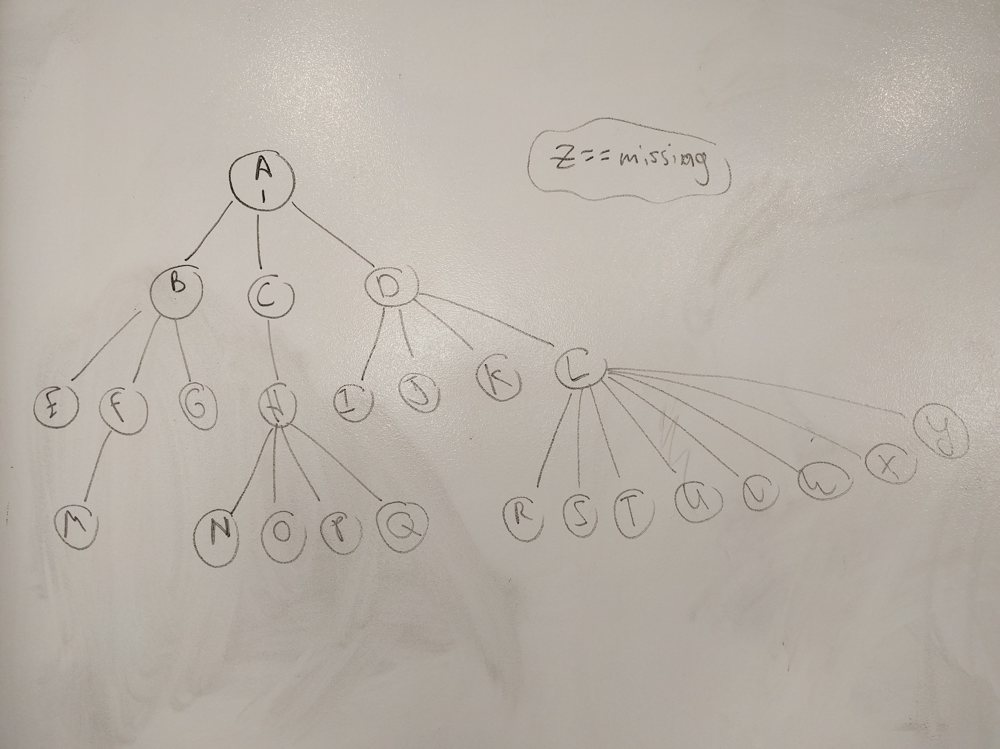

#  Breadth First Search Lab ( Trees )

## Introduction

In this lab, you will be creating your very own *Tree* class. **Note**: it has to be a general tree structure, **not** a *Binary Tree*.
Then you will modify the BFS algorithm you wrote to work on generic tree structures with 0 or more leaf nodes.

## Exercise

You will be creating:
- `Node.java` class that has a `Character value` field and a `ArrayList<Node> children` field for zero or more children.
- `Tree.java` class with a  `Node root` and a `findValueByBfs(Character seekValue)` public method.

Your Tree must look like this image. Create a helper method to create the nodes and children in Tree's constructor.

#### Requirements

* Include 25 letters of the alphabet from A-Y inside of your tree to match the above image.
* Seeking for value `Z` should return no result or null while seeking for any value `A-Y` should produce a result that find said value.

#### Deliverable

A working IntelliJ project that includes a `Main.java, Node.java, and Tree.java` files.

`Tree.java` file must have a working `findValueByBfs(Character seekValue)` method ( called from Main.java ) that looks for any character inside the tree and accurrately finds if it exists.

Compare your results to [solution code](solution-code/)
