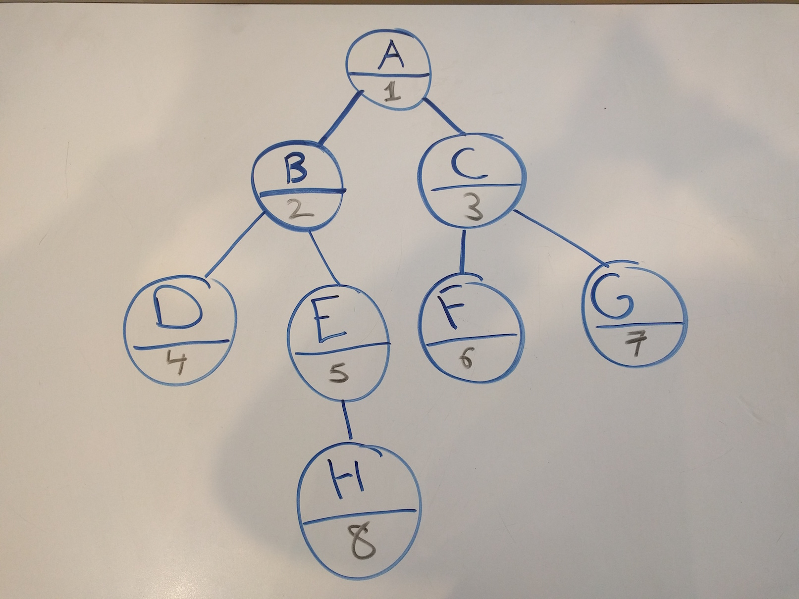

#  Breadth First Search ( Trees )


### LEARNING OBJECTIVES
*After this lesson, you will be able to:*
- Understand how the Breadth First Search Algorithm works
- Write psuedo code for Breadth First Search Algorithm
- Implement Breadth First Search Algorithm in Java

### STUDENT PRE-WORK

*Before this lesson, you should already be able to:*
- Understand basics of Trees and their Node classes.


### INSTRUCTOR PREP

*Before this lesson, instructors will need to:*
- Open and run the starter and solution code
- Modify sections and checks as needed

---
<a name="opening"></a>
## Opening (5 min)

Image you are building the next Ancestry.com service. 

> Check: How would you store all of the family histories that you have in your database? 

Sure you know about Arrays and Lists, but would either of these structures preserve the hierarchy of the **family tree**? 

No, they wouldn't. However, if we store the family history inside of a **Tree** structure we can preserve that hierarchy. Hence, your grandmother will be ranked above your mother and thus above yourself because she was born first.
```
      Grandmother
      /          \ 
   Mother        Uncle
   /  \          /     \
 You  Brother  Cousin1  Cousin2
 ```

Now what if we wanted to find certain information on a family member, like whether you have a Jenny Johnson family member somewhere inside the family tree structure?

> Check: Predict of ways you might search through this tree for information

*Breadth First Search* (BFS) is a way to search for a value in a Tree or Graph.

---
<a name="intro"></a>
## Introduction (30 min)

#### What is Breadth First Search? (10 min)

Imagine you have 8 nodes. Each of these 8 nodes has a value and each may or may not have some children ( remember that a tree node may have many children. If each root node only has 2 children, then the tree is a *binary tree*). 

Suppose this is true of the 8 nodes:
- Node H exists with value 8. It has no children.
- Node G exists with value 7. It has no children.
- Node F exists with value 6. It has no children.
- Node E exists with value 5. It has one child, left Node H.
- Node D exists with value 4. It has no children.
- Node C exists with value 3. It has two children, left Node F and right Node G.
- Node B exists with value 2. It has two children, left Node D and right Node E.
- Node A exists with value 1. It has two children, left Node B and right Node C. This node is the **root** of the tree.

> Check: Take 5 minutes and draw this tree structure out using whiteboards, paper, visual diagrams or text editors.

<details>
   <summary>Take a peek at the solution here</summary>
      
</details>

What if we want to find the Node that holds the value of 8? It's easy for us, we just look at the image we sketched and know that is Node H. But, before we drew the sketch out do you think you would have known it was Node H? Sure, because you had the information about all 8 nodes and their values. 

What if the only information you had to go off of was that Node A has a value of 1 and it has two children. Now the problem is much harder. In order to look for the Node with value of 8, we have to first look at the value of Node A. If we don't find a match, we look at Node A's children and their values, and when we don't find a match, we look at the grand-children of Node A and their values and so on. This is *Breadth First Search*. 

#### Definition (15 min)

"Breadth First Search (BFS) searches breadth-wise in the problem space. Breadth-First search is like traversing a tree where each node is a state which may a be a potential candidate for solution. It expands nodes from the root of the tree and then generates one level of the tree at a time until a solution is found. It is very easily implemented by maintaining a queue of nodes. Initially the queue contains just the root. In each iteration, the node at the head of the queue is removed and then expanded. The generated child nodes are then added to the tail of the queue." [1](http://intelligence.worldofcomputing.net/ai-search/breadth-first-search.html#.V6kLjpMrJXg)

Below, you see an illustration of *Breadth First Search* algorithm on a tree that is *4 levels* deep.
* A node turns gray when we first discover that the node exists and **add it to the queue**.
* A node turns black when we **remove it from the queue**. 


<details>
   <summary>Queue representation in steps for the above diagram</summary>
```java
// Assume that a new queue is created and that `Node a` is provided as the root ( following the above example )
Step 0.  Queue q = new Queue(); // New queue is created before we traverse the tree.
Step 0.  int seekValue = 8;     // Value to find
Step 0.  Node a;                // Provided root 

Step 1.  Status of queue: [ A ] - q.enqueue(a); // Root `Node a` is added to queue. 
Step 2.  Status of queue: [   ] - q.dequeue(); // Remove first element of queue, aka the root node `a`. 
Step 3.  Status of queue: [   ] - Check value of `Node a`, it does not match seekValue of 8. 

Step 4.  Status of queue: [ B ] - q.enqueue(a.leftChild()) // Add left child of node `a` to queue. 
Step 5.  Status of queue: [ B, C ] - q.enqueue(a.rightChild()) // Add right child of node `a` to queue. 
Step 6.  Status of queue: [ C ] - q.dequeue(); // Remove node b from queue so we can check its value. 
Step 7.  Status of queue: [ C ] - Check value of `Node b`, it does not match seekValue of 8. 

Step 8.  Status of queue: [ C, D ] - q.enqueue(b.leftChild()) // Add left child of node `b` to queue. 
Step 9.  Status of queue: [ C, D, E ] - q.enqueue(b.rightChild()) // Add right child of node `b` to queue. 
Step 10. Status of queue: [ D, E ] - q.dequeue(); // Remove node `c` from queue so we can check its value. 
Step 11. Status of queue: [ D, E ] - Check value of `Node c`, it does not match seekValue of 8. 

Step 12. Status of queue: [ D, E, F ] - q.enqueue(c.leftChild()) // Add left child of node `c` to queue. 
Step 13. Status of queue: [ D, E, F, G ] - q.enqueue(c.rightChild()) // Add right child of node `c` to queue. 
Step 14. Status of queue: [ E, F, G ] - q.dequeue(); // Remove node `d` from queue so we can check its value. 
Step 15. Status of queue: [ E, F, G ] - Check value of `Node d`, it does not match seekValue of 8. 

Step 17. Status of queue: [ F, G ] - q.dequeue(); // Node `d` has no children to add. Remove next node `e` from queue. 
Step 18. Status of queue: [ F, G ] - Check value of `Node e`, it does not match seekValue of 8. 

Step 19. Status of queue: [ F, G, H ] - q.enqueue(e.leftChild()) // Add left child of node `e` to queue. 
Step 20. Status of queue: [ F, G, H ] - `Node e` has no right child skip adding the right child to queue.
Step 21. Status of queue: [ G, H ] - q.dequeue(); // Remove node `f` from queue so we can check its value. 
Step 22. Status of queue: [ G, H ] - Check value of `Node f`, it does not match seekValue of 8. 

Step 23. Status of queue: [ H ] - q.dequeue(); // Node 'f' has no children to add. Remove next node 'g' from the queue. 
Step 24. Status of queue: [ H ] - Check value of `Node g`, it does not match seekValue of 8. 

Step 23. Status of queue: [   ] - q.dequeue(); // Node 'g' has no children to add. Remove next node 'h' from the queue. 
Step 24. Status of queue: [   ] - Check value of `Node h`, it matches seekValue of 8! . Return node `h` as the answer.

```
</details>


#### Pros and Cons (5 min)

> Check: As a group, discuss any advatages or disadvantages you can think of to this searching approach.

**Pros**: Advantages of Breadth First Search
- BFS will never get trapped exploring the useless path forever.
- If there is a solution, BFS will definitely find it out.
- If there are more one solutions then BFS will find the solution that requires least number of steps.

**Cons**: Disadvantages of Breadth First Search
- Each level of the tree must be saved in a queue in order to generate the next level. As a result, BFS is severely space-bound in practice and will eventually exhaust the memory available on computers if the solution is at the bottom of a very large tree.
- The further a solution is from the root, the longer the algorith takes to find it. 


---
<a name="grp-practice"></a>
## Exercises: Breadth First Tree Search (25 min)

1. In English, describe how you would use breadth first search to find any node with a given value. Your algorithm should assume you have a tree data structure and that you can access each node's value and its array of children (do not assume it's a binary tree which has only 2 children). You can assume you're given a target value to find.

2. On the whiteboard, pseudocode a breadth first search method. Assume you have a tree data structure that allows the following operations on all nodes:
      * `node.getValue()` returns the value of the node
      * `node.getChildren()` returns an `ArrayList<Node>` of size zero or more ( if size is always 2, then its a binary tree ).
      * You are given the tree root node as `Node root` parameter into your search method.

3. In English, describe how you would modify your breadth first search function to work on a binary search tree. Remember, a *Binary Search Tree* is a tree where all the children to the left of the parent hold a lower value than the parent while all the children to the right hold a greater value.

      <details>
      <summary>Binary Search Tree Illustration with a root node that has value of 4</summary>
      ```
            4
           / \
         2     6
        / \   / \
       1   3 5   7
      ```
      </details>

---
<a name="ind-practice"></a>
## Independent Practice (20 min)

You will be writing the algorithm for *Breadth First Search*.

Open the [starter code](starter-code/) inside **IntelliJ**. Inside the `BinaryTree.java` you will find the `findValueUsingBfs()` method. Your job is to complete this method so that when the program runs, it will find
the node with `seekValue = 8` ( defined in `Main.java`. Try changing the `seekValue` to verify the algorithm you 
wrote alctually works.

You can reference the [solution code](solution-code/) to check your answer.

---
<a name="ind-practice"></a>
## Conclusion (5 min)

*Breadth First Search* is an easy way ( in terms of implementation ) to search over trees for a certain value. You can also run this algorithm over a *Graph*.

* What are the pros of BFS?
* What are the cons of BFS?

Tomorrow, we will learn about *Depth First Search*, another way of searching a tree structure. It too has its pros and cons but it shines where the BFS does not.
