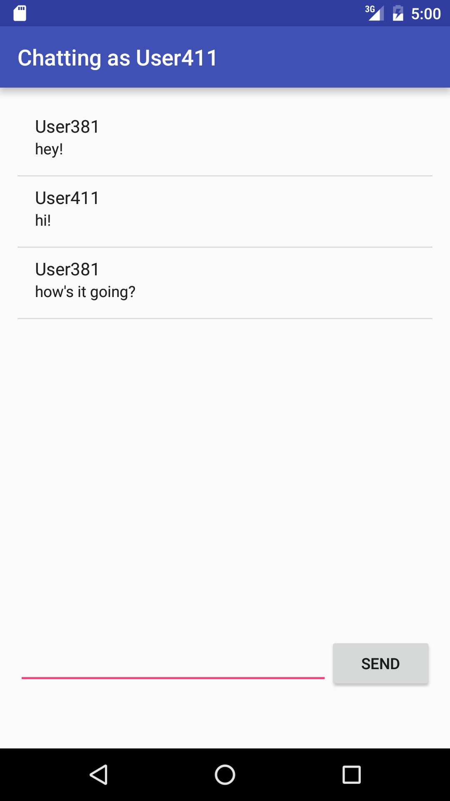

#  Firebase Chatroom

## Introduction

> ***Note:*** This lab should be done in pairs

In this lab you will be working in pairs to create a chatroom app using Firebase. The chatroom consists of a chat window showing all messages, an edit text to type in a message, and a send button to send the message.

When you send the message, it should immediately be synced to all users through Firebase.

**Hint:** You can use custom classes when storing and retrieving data in Firebase.

## Exercise

#### Requirements

- Assign a random username when launching the app
- Allow the user to send chat messages
- Immediately sync chat messages to all users in the chatroom through Firebase

**Bonus:**
- Allow the user to change their username
- Allow the user to set a custom color for their username
- Create multiple chat rooms

#### Deliverable

An app that allows people to join the chatroom, and send chat messages to each other.

## Additional Resources

- [Firebase Quickstart](https://www.firebase.com/docs/android/quickstart.html)
- [Firebase UI](https://github.com/firebase/FirebaseUI-Android)
