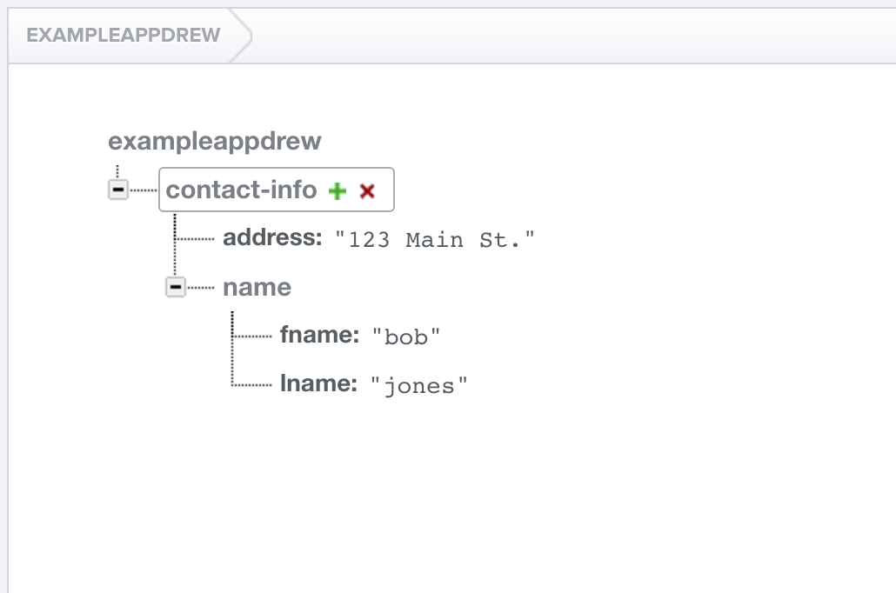

#  Firebase


### LEARNING OBJECTIVES
*After this lesson, you will be able to:*
- Explain the basics of Firebase
- Integrate Firebase into your apps

### STUDENT PRE-WORK
*Before this lesson, you should already be able to:*
- Describe the basics of databases

### INSTRUCTOR PREP
*Before this lesson, instructors will need to:*
- Read through the lesson
- Add additional instructor notes as needed
- Edit language or examples to fit your ideas and teaching style
- Open, read, run, and edit (optional) the starter and solution code to ensure it's working and that you agree with how the code was written

---
<a name="opening"></a>
## Opening (5 mins)

Databases can be a crucial part of our apps, but we are normally limited by this data being isolated by each device. The obvious solution would be to host our database on the internet, and access it from the app. While this sounds like a great idea, this can result in long delays. Firebase provides us with a fast, easy to set up answer.

> Check: Ask the students if they've heard of Firebase before.

***

<a name="introduction"></a>
## Introduction: What is Firebase (10 mins)

Firebase is a quick way to store your app's data on the cloud in a structured, but very flexible manner. While it holds your data in a database, it is fundamentally different from what we're used to in SQLite.

In Firebase, you don't set up Columns, Data types, keys, etc. ahead of time. You simply add and modify the data on-the-fly. Some of the biggest features of Firebase are how fast it is, and how quickly it can automatically sync the data on your apps. As soon as changes are made online, all apps connected to your Firebase database are notified of the changes, and can update their view accordingly. This is not just limited to Android, but reflects across all platforms (iOS, web, etc.).

[Let's watch a quick video.](https://www.youtube.com/watch?v=SLgHfH7KzXU)

> Check: Ask the students to discuss with each other (2 mins) ideas where Firebase could be used.

***

<a name="demo"></a>
## Demo: Setting Up Firebase (10 mins)

Actually setting up Firebase is extremely simple. After creating a new Android Studio project, go to File -> Project Structure.

Then choose the Cloud tab, and check the box next to Firebase.


This automatically imports the necessary libraries with Gradle, and adds the Internet permission to the Manifest.

There are only two other steps you need to manually complete. First is to add the following code to your Gradle file under the android section. It stops any build errors from occurring if there are conflicting licensing files with other libraries.

```xml
packagingOptions {
        exclude 'META-INF/LICENSE'
        exclude 'META-INF/LICENSE-FIREBASE.txt'
        exclude 'META-INF/NOTICE'
    }
```

The second step is to set the context Firebase is going to work in. Often, we work directly with the Activity's context, so we could set up Firebase to use that. A better solution is to enable Firebase to work with our app regardless of what activity the app is started with. To do this, we need to create a new Java file, extend Application, and add the following code to it. We also need to reference this file in the Manifest in the Application tag.

```java
@Override
public void onCreate() {
    super.onCreate();
    Firebase.setAndroidContext(this);
}
```

```xml
android:name=".MyApplication"
```

> Check: Was everyone able to set it up correctly?

***

<a name="introduction"></a>
## Introduction: Storing Data in Firebase (10 mins)

As we mentioned before, data isn't stored in the same column structure we were used to in SQLite. Let's take a look at some sample data.



> Ask the students what this reminds them of.

This is just like JSON data, with nested data structures of key-value pairs. In fact, we can even export it as a json file.

> Have the students discuss advantages and disadvantages to storing all of the data like this, in JSON form. (3 mins)

This gives us great flexibility in terms of how we store the data, as well as quickly changing the details of the data, but we lose a lot of the structure and safety checks associated with a normal relational database.

***

<a name="demo"></a>
## Demo: Retrieving Data (5 mins)

We are going to allow the user to type in text into an EditText, and store it in Firebase.

First, let's set up our TextView, and EditText, and a Button to submit the text.

```xml
<TextView
        android:id="@+id/current_text"
        android:layout_width="wrap_content"
        android:layout_height="wrap_content"
        android:text="Hello World!"
        android:layout_centerInParent="true"/>

    <EditText
        android:id="@+id/edit_text"
        android:layout_width="match_parent"
        android:layout_height="wrap_content"
        android:layout_centerHorizontal="true"
        android:layout_below="@id/current_text"/>

    <Button
        android:id="@+id/submit_button"
        android:layout_width="wrap_content"
        android:layout_height="wrap_content"
        android:layout_centerHorizontal="true"
        android:layout_below="@id/edit_text"
        android:text="Submit"/>
```

Now we need to set up our references to the views in our MainActivity.

```java
mCurrentText = (TextView) findViewById(R.id.current_text);
mNewText = (EditText)findViewById(R.id.edit_text);
mSubmitButton = (Button)findViewById(R.id.submit_button);
```

The next thing we need to do is create a Firebase object. This object is where most of our interaction with Firebase will be funneled through.

```java
Firebase mFirebaseRef;
```

```java
mFirebaseRootRef = new Firebase("https://exampleappdrew.firebaseio.com");

        Firebase firebaseCurrentTextRef = mFirebaseRootRef.child("currentText");
```

The `currentText` in the second line lets us select which node we want to access. If we wanted to, we could add "/currentText" onto the end of the URL, but then our access would be limited to that node.

Just like with ClickListeners, Firebase has ValueEventListeners that listen for changes in data on the database.

```java
firebaseCurrentTextRef.addValueEventListener(new ValueEventListener() {
            @Override
            public void onDataChange(DataSnapshot dataSnapshot) {
              String text = dataSnapshot.getValue(String.class);
                mCurrentText.setText(text);
            }

            @Override
            public void onCancelled(FirebaseError firebaseError) {

            }
        });
```

`onDataChange` is triggered whenever data is changed on Firebase, and `onCancelled` is triggered when there is an error with the connection.

Notice how we passed String.class to the getValue method. This is basically like casting the data being retrieved, but it works for **any Java object, even custom ones.**

Let's try it out!

> Go to your browser and change the data manually

That's all there is to reading data!

> Check: Was everyone able to complete the demo?

***

<a name="demo"></a>
## Demo: Writing Data (5 mins)

Now let's complete the app by adding the ability to write data.

> Ask the students what we want to write, and how it will show up on our screen.

```java
mSubmitButton.setOnClickListener(new View.OnClickListener() {
            @Override
            public void onClick(View v) {
                firebaseCurrentTextRef.setValue(mNewText.getText().toString());
            }
        });java

```

Now everyone change their Firebase reference to point to my database. Now all of you can read and write to my database as well!

> Check: What security problems could our current setup present?

***

<a name="introduction"></a>
## Introduction: Child Events (5 mins)

The ValueEvents that we just worked with are great for primitives and Objects, but if we want to work with things like lists of data, we want to use ChildEvents. ValueEvents passes back the entire object when a change is made, whereas ChildEvents can give us the individual items.

***

<a name="demo"></a>
## Demo: Child Events (5 mins)

Lets try adding a ChildEventListener to our code. It starts off just like our ValueEventListener, but the autocomplete looks very different.

> Walk through the methods with the students. Remember that onChildAdded is called when pulling down existing data.

***

<a name="guided-practice"></a>
## Guided Practice: Binding data to a ListView (10 mins)

Let's take our knowledge of ChildEvents and apply it to a ListView.

> Prompt the students to help complete these steps.

1. add a ListView to the app, and create a reference to it in our MainActivity.
2. Create an ArrayList to hold our data
3. Create an ArrayAdapter
4. Add messages when onChildAdded is called, and call notifyDataSetChanged

```xml
<ListView
        android:id="@+id/list"
        android:layout_width="match_parent"
        android:layout_height="wrap_content"
        android:layout_below="@id/submit_button"/>
```

```java
public class MainActivity extends AppCompatActivity {
    TextView mCurrentText;
    EditText mNewText;
    Button mSubmitButton;
    ListView mListView;

    Firebase mFirebaseRootRef;

    ArrayList<String> mMessages;

    @Override
    protected void onCreate(Bundle savedInstanceState) {
        super.onCreate(savedInstanceState);
        setContentView(R.layout.activity_main);

        mCurrentText = (TextView) findViewById(R.id.current_text);
        mNewText = (EditText)findViewById(R.id.edit_text);
        mSubmitButton = (Button)findViewById(R.id.submit_button);
        mListView = (ListView)findViewById(R.id.list);

        mFirebaseRootRef = new Firebase("https://exampleappdrew.firebaseio.com");

        final Firebase firebaseCurrentTextRef = mFirebaseRootRef.child("currentText");

        Firebase firebaseMessageRef = mFirebaseRootRef.child("messages");

        mMessages = new ArrayList<>();

        firebaseCurrentTextRef.addValueEventListener(new ValueEventListener() {
            @Override
            public void onDataChange(DataSnapshot dataSnapshot) {
                String text = dataSnapshot.getValue(String.class);
                mCurrentText.setText("Latest Text: " + text);
            }

            @Override
            public void onCancelled(FirebaseError firebaseError) {

            }
        });


        mSubmitButton.setOnClickListener(new View.OnClickListener() {
            @Override
            public void onClick(View v) {
                firebaseCurrentTextRef.setValue(mNewText.getText().toString());
            }
        });

        final ArrayAdapter<String> adapter = new ArrayAdapter<String>(this,android.R.layout.simple_list_item_1,mMessages);
        mListView.setAdapter(adapter);

        firebaseMessageRef.addChildEventListener(new ChildEventListener() {
            @Override
            public void onChildAdded(DataSnapshot dataSnapshot, String s) {
                String message = dataSnapshot.getValue(String.class);
                mMessages.add(message);
                adapter.notifyDataSetChanged();
            }

            @Override
            public void onChildChanged(DataSnapshot dataSnapshot, String s) {

            }

            @Override
            public void onChildRemoved(DataSnapshot dataSnapshot) {

            }

            @Override
            public void onChildMoved(DataSnapshot dataSnapshot, String s) {

            }

            @Override
            public void onCancelled(FirebaseError firebaseError) {

            }
        });
    }
}
```

One last note: To add values to a list with auto-generated keys, you use the following code:

```java
firebaseMessageRef.push().setValue("test insert2");
```

> Check: Were students able to successfully solve the problem or complete the task?

***

<a name="introduction"></a>
## Introduction: FirebaseUI (5 mins)

ChildEvents work fine when adding data to a list, but certain UI operations such as changing and deleting can quickly become very complicated. Luckily, Firebase provides the FirebaseUI library to help manage UI elements connected to Firebase, perform easy authentication, and other useful things!

[Check out the documentation](https://github.com/firebase/FirebaseUI-Android)

> Check: Ask the students why change and remove would be hard to manage in the ListView example

***

<a name="demo"></a>
## Demo: FirebaseUI (5 mins)

First, we need to add FirebaseUI to our gradle file.

```
compile 'com.firebaseui:firebase-ui:0.3.1'
```

Since we want to change our ListView to work with FirebaseUI, we are going to use the  FirebaseListAdapter.

```java
FirebaseListAdapter<String> adapter = new FirebaseListAdapter<String>(this, String.class, android.R.layout.simple_list_item_1, firebaseMessageRef) {
            @Override
            protected void populateView(View view, String s, int i) {
                TextView textView  = (TextView)view.findViewById(android.R.id.text1);
                textView.setText(s);
            }
        };

        mListView.setAdapter(adapter);
```

> Check: Ask the students what situations we would want to use FirebaseUI in.

***

<a name="ind-practice"></a>
## Independent Practice: Topic (10 mins)

Work with a partner to make a working version of Tic-Tac-Toe. You will create a layout with 9 EditTexts. The text you type into one of the EditTexts should sync immediately on the second person's device.

Hint: Try using addTextChangedListener

> Check: Were the students able to complete the activity?

***

<a name="conclusion"></a>
## Conclusion (5 mins)

Firebase is a very powerful tool for moving our databases to the cloud. The setup is extremely fast, and requires very little effort. Even though the structure is different than what we are used to with databases, our familiarity with JSON makes this transition much easier. Going forwards, consider adding Firebase to your apps to make syncing data much easier.

***

### ADDITIONAL RESOURCES
- [Firebase Quickstart](https://www.firebase.com/docs/android/quickstart.html)
- [Firebase UI](https://github.com/firebase/FirebaseUI-Android)
