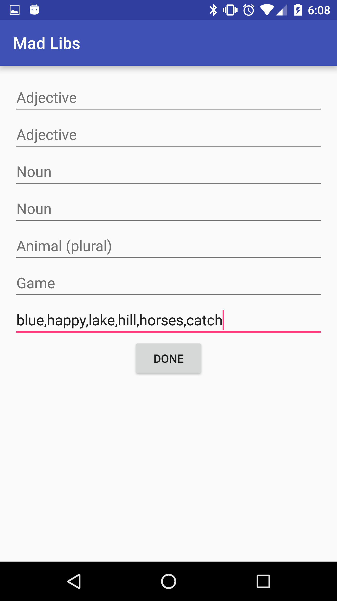
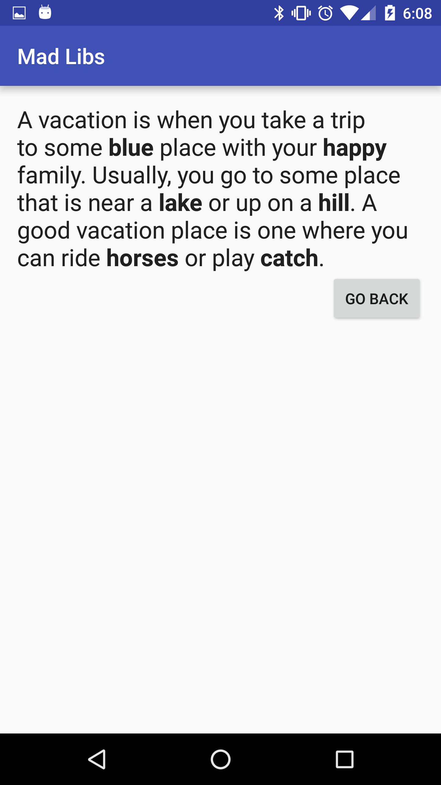
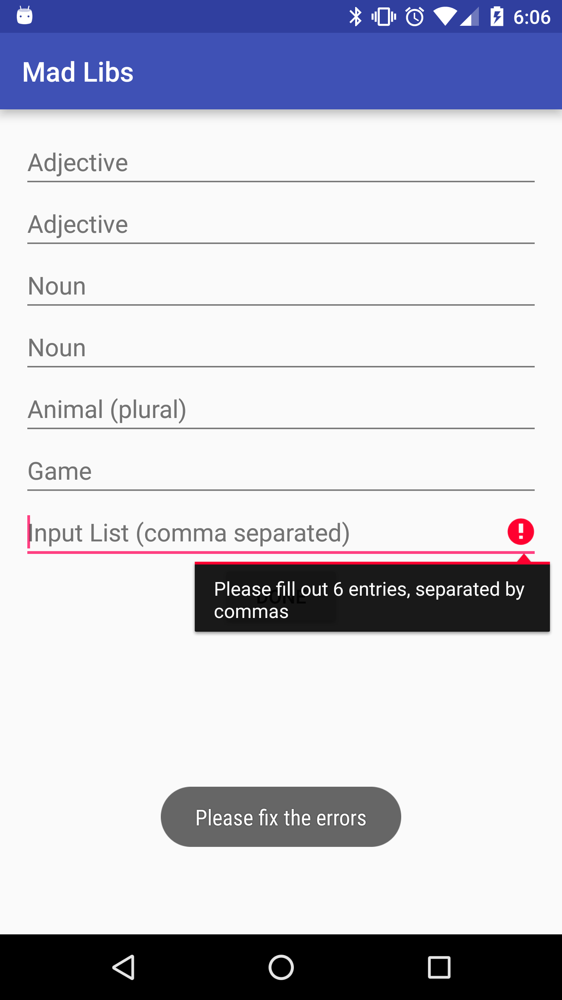
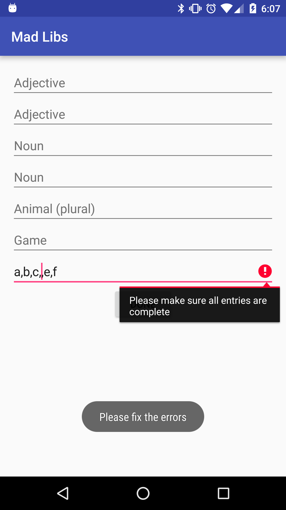

<!--  OUTSTANDING
1. Where is the "Testing Quick Guide"
2. Instructions on running tests
-->

#  Mad Libs Game App Part 2

In this lab, you will be expanding on the *Mad Libs* app we made in the previous lab.

Previously, there were separate input boxes for each of the required words. Now, you will make a new input box where all of the input will go, separated by commas. For example, valid input would look like "blue,happy,lake,hill,horses,catch".  The app should take that array and populate the next activity with the contents of the array.

This lab will let you practice sending data collections from one activity to another. Also, it will help you practice parsing user data into data collections.

## Exercise

#### Requirements

Using the [provided project](starter-code), the main activity should be laid out as follows:

* The layout should have at least one EditText to allow a user to provide values separated by commas. The original six EditTexts are not required, so you may replace them with TextViews that give the same hints, if you wish. The remaining required EditText accepts the input for all six words, where each entry is separated by a comma.

* The app should accept the following: two adjectives, two nouns, animals (plural), and a name of a game
* For testing purposes, the final, input EditText and the Done button must have the following ids:

	* **input_edittext**
	* **submit_button**

* The app should have a button that submits the data and starts the ResultActivity. **The data must be passed as an array**.

	* If this is pressed and the EditText is not filled out correctly, then the EditText must show an error (via [EditText.setError()](http://developer.android.com/reference/android/widget/TextView.html#setError(java.lang.CharSequence)).

* The ResultActivity already takes given text and puts it in a string. Unlike the previous lab, **you must make modifications to ResultActivity**. Since you are now passing the data in an array, ResultActivity must be changed to use this new data type.

**Bonus**

* If too few inputs were provided, fill the completed input fields with the provided words and display errors in the incomplete ones.

* Add a "Shuffle" button to the ResultActivity that will shuffle the provided words in a random order.

#### Starter code

If your code from the previous Mad-Libs lab is working correctly, you may replace the provided starter code with your code.

If it is not working correctly, use the [starter-code](starter-code) and import it into Android Studio - it is the solution code for the previous lab.

Included in this lab are the following:

* Two activities: [**Main Activity**](starter-code/app/src/main/java/co/ga/madlibs/MainActivity.java) and [**Result Activity**](starter-code/app/src/main/java/co/ga/madlibs/ResultActivity.java).

	* Main Activity. This is where you'll do most of your work.
	* Result Activity will take the words provided by the main activity and display the resulting mad libs paragraph.

* Two layout files: [**activity_main.xml**](starter-code/app/src/main/res/layout/activity_main.xml) and [**activity_result.xml**](starter-code/app/src/main/res/layout/activity_result.xml).

#### Deliverable

An Android app that follows the requirements above. There are no design requirements aside from having the seven EditTexts and the button; feel free to play around with color, font, backgrounds, etc.

Post the project on GitHub. Ensure that the project builds and runs successfully and that the tests are passing. Please refer to the "Testing Quick Guide" for info on how to run a test in Android Studio.

	   

## Additional Resources

* [Official Android Developer Website](http://developer.android.com/training/index.html)
* [Building a Simple User Interface](http://developer.android.com/training/basics/firstapp/building-ui.html)
* [Starting Another Activity](http://developer.android.com/training/basics/firstapp/starting-activity.html)
