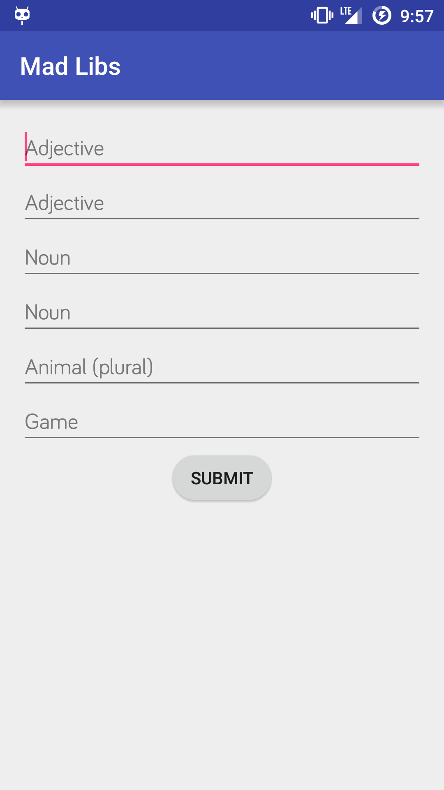
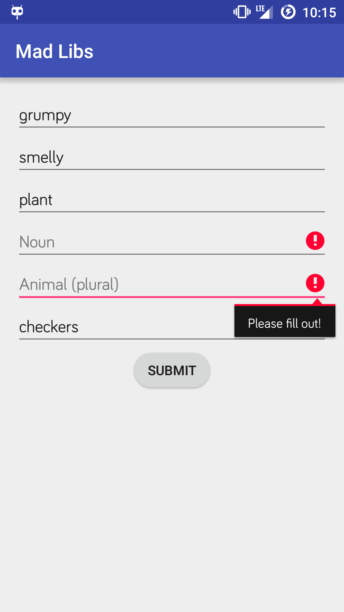
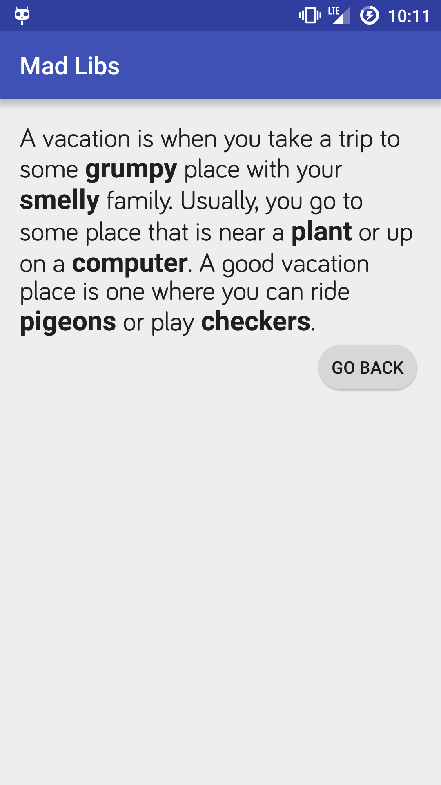

#  Mad Libs Game App

In this lab, you will be creating an app based on the game *Mad Libs*.

Mad Libs is a game where you provide certain words and the words are then inserted into a pre-written paragraph with blank spots for fill-ins. Typically, you read the sentence out loud, which usually creates a random (and hopefully, funny) story. [Here's an example of a Mad Lib](http://www.classroomjr.com/wp-content/uploads/2010/05/funny-mad-libs.gif).

This lab will let you practice starting activities and sending data from one activity to another. Also, it will help you practice getting data input from the user, and showing errors when the user doesn't provide data.

## Exercise

#### Requirements

Using the [provided project](starter-code):

The main activity should be laid out as follows:

* The layout should have 6 EditTexts, each with hints that describe what type of word is expected.
	* The app should accept the following: 2 adjectives, 2 nouns, animals (plural), and a name of a game.
	* For testing purposes, the 6 EditTexts must have the following ids (in no particular order):

		* **adjective1_edittext**
		* **adjective2_edittext**
		* **noun1_edittext**
		* **noun2_edittext**
		* **animals_edittext**
		* **game_edittext**


* The app should have a button that submits the data and starts the ResultActivity.

	* If this is pressed and an edittext is not filled out, that edit text must show an error (via [EditText.setError()](http://developer.android.com/reference/android/widget/TextView.html#setError(java.lang.CharSequence)).


* The ResultActivity already takes given text and puts it in a string. You have to provide the 6 words, in a bundle, to the activity when starting it. In the ResultActivity, there are public static variables you can use as keys for the bundle.
	* An example would be using:

	```java
		bundle.put(ResultActivity.NOUN1, "Bear");
	```


Refer to the [solution-code](solution-code), if needed.


#### Starter code

Grab the [starter-code](starter-code) and import it into Android Studio is required for this lab.

Included in this lab are the following:

* Two activities: [**Main Activity**](starter-code/app/src/main/java/co/ga/madlibs/MainActivity.java) and [**Result Activity**](starter-code/app/src/main/java/co/ga/madlibs/ResultActivity.java).

	* Main Activity is an empty activity. This is where you'll do most of your work.
	* Result Activity will take the words provided by the main activity and display the resulting mab lib paragraph.
		* Result Activity is a fully-developed class. *You will not be editing this class*, but instead sending it data from Main Activity.


* One layout file: [**activity_main.xml**](starter-code/app/src/main/res/layout/activity_main.xml).

	* This file is not empty. It contains a couple of nested view groups, to make your life easier. It makes the app scrollable in case your views become taller than the screen. This is covered more in depth in a future lesson.
	* Put all of your views in the innermost view, the LinearLayout. The LinearLayout can be changed to another layout, if you'd like.


#### Test your code

Included in this lab is a test suite you can use to test you code. The starter-code already has all the tests set up and available to you. These test use AndroidJUnit4 and Espresso. Be sure your phone or emulator are unlocked when running these tests.

In order to run these tests, go to the Build Variants section of Android Studio (usually bottom left of screen) and be sure to set "Test Artifacts" to "Android Instrumentation Test". Right click on the MadLibTest.java file and click "Run MadLibTest".

This will test a couple things about your application.

* If you have all the widgets needed and have id'd them correctly
* Tests if you can successfully start you ResultActivity
* Tests if you can send data with intent to the ResultActivity
* Tests if all EditText show errors on empty text

#### Deliverable

An Android app that follows the requirements above. There are no design requirements aside from having the six EditTexts and the button; feel free to play around with color, font, backgrounds, etc.

Post the project on GitHub. Ensure that the project builds and runs successfully and that the tests are passing. Please refer to the Testing Quick Guide for info on how to run a test in Android Studio.

  


## Additional Resources

* Official Android Developer Website - http://developer.android.com/training/index.html
	* [Building a Simple User Interface](http://developer.android.com/training/basics/firstapp/building-ui.html)
	* [Starting Another Activity](http://developer.android.com/training/basics/firstapp/starting-activity.html)
