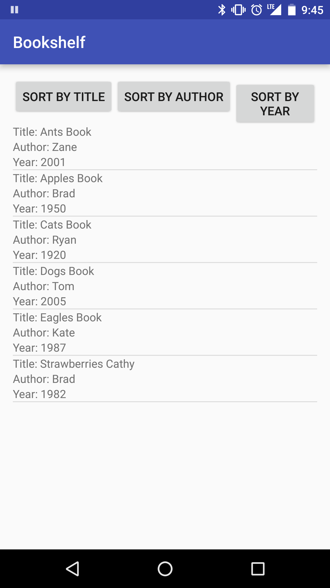
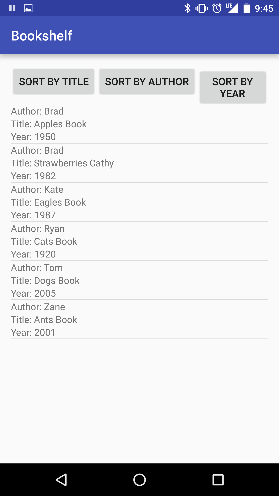
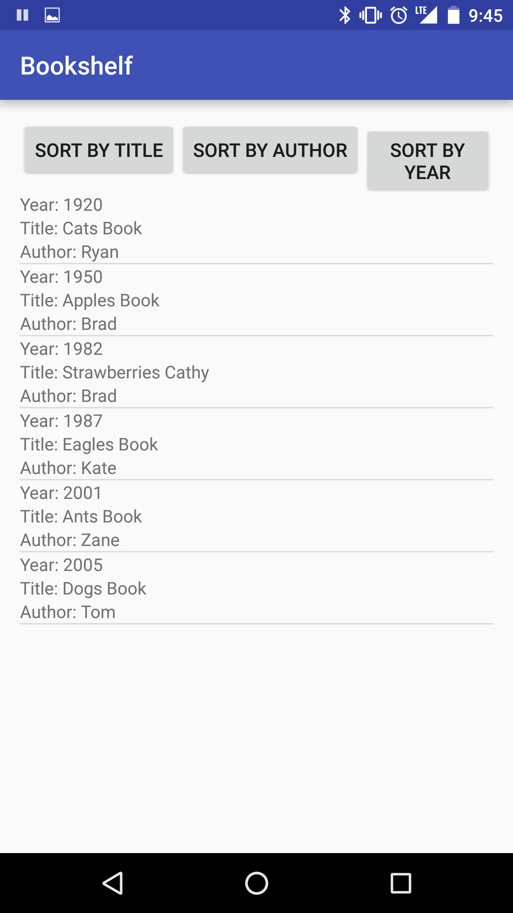

#  ListViews and ListAdapters - Bookshelf

## Introduction

> ***Note:*** _This can be a pair programming activity or done independently._

In this lab, you will be building a ListView that shows your collection of books. The activity will have buttons to sort the books by title, year, or author. Each sort will have a different layout for the list item, making the sorted category first on the list item.

## Exercise

#### Requirements

- Make a ListView display sorted books
- Show title, author, and year for each list item (first text should be the item being sorted)
- On launch, the book shelf must be sorted by title
- Allow the user to sort by title, year, or author
- Custom comparators must be used to resort based on the currently selected sort

**Bonus:**
- Add additional book information to be displayed
- Allow the user to sort by the new information

#### Starter code

The `starter-code` folder contains an Android project with the following:

- A completed Book.java class
- An example of how to use a custom comparator in the ExampleComparator.java file

#### Deliverable

The three screenshots below show each sort being used on the list.

  
  
  

## Additional Resources

- [Java Listview](http://docs.oracle.com/javase/tutorial/uiswing/components/list.html)
- [Jave ListAdapters](https://developer.android.com/reference/android/widget/ListAdapter.html)
