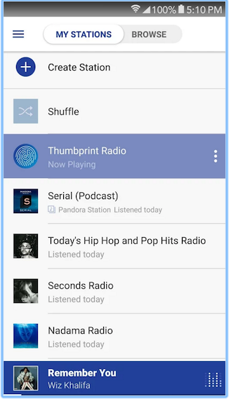

#  Custom Adapters

### LEARNING OBJECTIVES
*After this lesson, you will be able to:*
- Describe why you would use a Custom Adapter
- Create a custom adapter
- Create layouts for the custom adapter

### STUDENT PRE-WORK
*Before this lesson, you should already be able to:*
- Create a listView using ArrayAdapter
- Create classes and subclasses

### INSTRUCTOR PREP
*Before this lesson, instructors will need to:*
- Read through the lesson
- Add additional instructor notes as needed
- Edit language or examples to fit your ideas and teaching style
- Open, read, run, and edit (optional) the starter and solution code to ensure it's working and that you agree with how the code was written

---
<a name="opening"></a>
## Opening (5 mins)

When we want to create a list view, with complex list items, we have to use a Custom Adapter.



> Check: Pair up and list the types of views do you see for each list item.

As you can see, this layout is fairly complex. It contains an 
- ImageView for station thumbnail. 
- TextView for station name. 
- TextView when station was played.
- ImageView for currently selected station that is otherwise not visible.

***

<a name="introduction"></a>
## Introduction: View Recycling (10 mins)

ListView does something called view recycling.

Assume that we have a `ListView` that is holding 1,000 items. You might think that `ListView` will inflate 1,000 item layouts for each list item. That is not the case! List view will inflate **as many list item layouts as will fit on screen**. Meaning, if you can only see 7 elements at a time, then only 7 layouts are inflated.

These 7 layouts are then **re-used** between all 1000 items you have in your data list for your list view.


Image taken from this [guide](https://github.com/codepath/android_guides/wiki/Using-an-ArrayAdapter-with-ListView).

Notice how when we scroll the screen and element **1** moves offscreen while element **8** moves onto the screen. 
- Element 1 is moved offscreen, its `convertView` layout is then recycled and stored in memory
- `getView()` is called, and **re-uses** the already created `convertView`. But first, we need to make modifications to the `convertView` child elementss. If item layout at position 1 had a `TextView` with the text `"Position 1"`, now it will update the text to say `"Position 8"`. 
- The updated `convertView` layout is returned from the `Adapter` to the `ListView` and is drawn on screen.

## Steps to create Custom Adapter ( 5 min )

There are three parts to making a custom adapter. 
- 1. Layouts: Don't forget to include `ListView` inside your Activity xml layout. Next, we need to create a custom layout for the list item, lets call it `list_item.xml`.
- 2. Extend `BaseAdaper`.
- 3. Improve Performance with `ViewHolder Pattern` 

## 1. Layouts

#### Step 1) 

Add `ListView` item to your Activity layout xml with an id. Our view id here is `list_view`.

```xml
<ListView
    android:id="@+id/list_view"
    android:layout_width="match_parent"
    android:layout_height="wrap_content">
</ListView>	
```

#### Step 2) 

Create your own custom item layout. It models what each item in the row looks like.

Layout below is called `list_item.xml`. It has two `TextViews` inside a `LinearLayout` one `Button` that says "Click me".

TextViews each have their own id, starting with layout name, view type, and order.
So `list_item_tv_first` for the first text view inside `list_item.xml` layout. 

It is good practice to start getting organized with your id names.

> Check: Take a minute to pair up and discuss why we want to organize our xml id names.

```xml
<?xml version="1.0" encoding="utf-8"?>
<LinearLayout xmlns:android="http://schemas.android.com/apk/res/android"
    android:orientation="horizontal"
    android:layout_width="match_parent"
    android:layout_height="wrap_content"
    android:paddingLeft="@dimen/activity_horizontal_margin"
    android:paddingRight="@dimen/activity_horizontal_margin"
    android:paddingBottom="@dimen/activity_vertical_margin"
    android:paddingTop="@dimen/activity_vertical_margin"
    android:background="@android:color/holo_blue_dark">

    <TextView
        android:id="@+id/list_item_tv_first"
        android:layout_width="wrap_content"
        android:layout_height="wrap_content"
        android:layout_weight="2"
        android:text="First"/>

    <TextView
        android:id="@+id/list_item_tv_second"
        android:layout_width="wrap_content"
        android:layout_height="wrap_content"
        android:layout_weight="1"
        android:text="Second"/>

    <Button
        android:id="@+id/list_item_button"
        android:layout_width="wrap_content"
        android:layout_height="wrap_content"
        android:layout_weight="1"
        android:text="Click me"/>

</LinearLayout>

```

## 2. Extend BaseAdapter ( 40 mins )

#### Step 1) ( 2 min )

Lets create our Custom Base Adapter by creating a new file called `CustomBaseAdapter.java`. 

Next, extend the `BaseAdapter` class inside of `CustomBaseAdapter` class.

Notice that there **will be red warnings** from Android Studio. Its ok, don't panic, we will fix them.
```java
public class CustomBaseAdapter extends BaseAdapter {

}
```

#### Step 2) ( 5 min )

Next, let's make a constructor for our adapter that takes some data.

For this example, we need a `Context` object and an `ArrayList` of Animal Objects as our arguments to the constructor. 

Save a reference to both of these variables inside `CustomBaseAdapter` by declaring and assigning member variables `data` and `context`.

```java
public class CustomBaseAdapter extends BaseAdapter {
    private ArrayList<Animal> data;
    private Context context;

    public CustomBaseAdapter(Context context, ArrayList<Animal> animalList){
        this.data = animalList;
        this.context = context;
    }
}
```

Now the custom adapter has access to a context and some data!

> Check: Why do we need access to the data inside the adapter?

> Solution: The adapter binds the data to the views. Without the data there is nothing for the adapter to bind to the views.

#### Step 3) ( 5 min )

It's time to fix all the red warnings! Follow steps `a` and `b`. We must `implement` the methods declared inside the **abstract** `BaseAdapter` class. 

Inside CustomAdapter class, right click and select `Generate` or on mac press `command + n`. 

Next, select the `Implement Methods` option and press enter.

There will be another popup highlighting **4** methods. Make sure **all 4 are selected** and press enter again. Android Studio will add them into your `CustomBaseAdapter` class.

```java
public class CustomBaseAdapter extends BaseAdapter {
	    private ArrayList<Animal> data;
        private Context context;

    public CustomBaseAdapter(Context context, ArrayList<Animal> animalList){
        this.data = animalList;
        this.context = context;
    }

    @Override
    public int getCount() {
        return 0;
    }

    @Override
    public Object getItem(int position) {
        return null;
    }

    @Override
    public long getItemId(int position) {
        return 0;
    }

    @Override
    public View getView(int position, View convertView, ViewGroup parent) {
        return null;
    }
}
```

> Check: Why is it about the BaseAdapter that makes us implement the four methods?

> Solution: Base Adapter is an abstract class, and those four methods are abstract. They need to either be implemented or our CustomBaseAdaper class needs to become abstract.

#### Step 4) ( 20 min )

Lets add code to the **4** methods in steps in the following 4 steps.

###### Step a) ( 1 min )

`getCount()`: Returns the number of data items available. This is just the size of our `data` ArrayList
```java
@Override
public int getCount() {
    return data.size();
}
```

###### Step b) ( 2 min )

`getItem()`: Returns the data item at the specific position from our `data` ArrayList!
```java
@Override
public Object getItem(int position) {
    return data.get(position);
}
```

###### Step c) ( 2 min )

`getItemId()`: Returns the `unique id` identifying the item at this position. Such an id usually comes from a database. This example does not use a database. Therefore, we return the position since it is unique to each item in the list.
```java
@Override
public long getItemId(int position) {
    return position;
}
```

###### Step d) ( 15 min )

`getView()`: **Meat of the class**. Returns the actual list item view to be drawn inside the `ListView`. This method also binds the `data` list to the views associated with it. ( i.e. Setting data specific text on `TextViews`, images on `ImageViews`, etc ).

```java
@Override
public View getView(final int position, View convertView, ViewGroup parent) {
    /**
     * Convert view will be the top level view of our list item layout.
     *
     * For us this means its a LinearLayout.
     *
     * We check if its null, and non existent then we inflate the view. Otherwise
     * we want to re-use the current layout.
     */
    if (convertView == null) {
        convertView = LayoutInflater.from(context).inflate(R.layout.list_item, parent, false);
    }

    /**
     * Using our top level layout, we can find all the subviews we defined within it.
     *
     * For us, we know we have 2 TextViews and 1 Button.
     */
    TextView firstTextView = (TextView) convertView.findViewById(R.id.list_item_tv_first);
    TextView secondTextView = (TextView) convertView.findViewById(R.id.list_item_tv_second);
    Button button = (Button) convertView.findViewById(R.id.list_item_button);


    /**
     * We can pull out our data object from the data list using its position.
     *
     * In this case, we grab the current animal for this view based on its position
     * in the data list.
     */
    final Animal currentAnimal = data.get(position);

    /**
     * Now we can bind our data values from the currentAnimal object instance into our
     * views!
     *
     * In this case we take the animal name and number of legs and set them as text in
     * both TextViews
     */
    firstTextView.setText(currentAnimal.getName());
    secondTextView.setText(currentAnimal.getSound());

    
    /**
     * Lastly, we create a button click listener that will toast the animal name and sound.
     * 
     * First we store the String `animalName says: animalSound` inside a variable to use inside
     * the Toast
     */
    final String toastText = currentAnimal.getName() + " says: "+ currentAnimal.getSound();

    button.setOnClickListener(new View.OnClickListener() {
        @Override
        public void onClick(View v) {
            Toast.makeText(context, toastText, Toast.LENGTH_SHORT).show();
        }
    });

    /**
     * Return the whole item layout here so it can be drawn by the ListView
     */
    return convertView;
}
```

> Check: What does the getView() method do?

> Solution: It binds the data of each row element in the ListView to its respective view(s).

#### Step 5) ( 10 min )

Set the custom adapter on ListView `listView` variable inside Activity!

```java
public class MainActivity extends AppCompatActivity {
    private ListView listView;
    private ArrayList<Animal> animalList;

    @Override
    protected void onCreate(Bundle savedInstanceState) {
        super.onCreate(savedInstanceState);
        setContentView(R.layout.activity_main);

    	// find list view in main activity layout 
        listView = (ListView) findViewById(R.id.list_view);

    	// add some data to our animalList
        animalList = new ArrayList<>();
        animalList.add(new Animal("cow", "moo"));
        animalList.add(new Animal("cat", "meow"));
        animalList.add(new Animal("dog", "woof"));
        animalList.add(new Animal("sheep", "baaaa"));

    	// create an instance of our CustomBaseAdapter class, passing in context and data list 
        CustomBaseAdapter customBaseAdapter = new CustomBaseAdapter(MainActivity.this, animalList);
        
        // set custom adapter on our list view
        listView.setAdapter(customBaseAdapter);
    }
}
```

<details>
  <summary>Click here to see Animal.java</summary>
```java
public class Animal {
    private String name;
    private String sound;

    public Animal(String name, String sound){
        this.name = name;
        this.sound = sound;
    }

    public String getName() {
        return name;
    }

    public void setName(String name) {
        this.name = name;
    }

    public String getSound() {
        return sound;
    }

    public void setSound(String sound) {
        this.sound = sound;
    }
}
```
</details>


<a name="ind-practice"></a>
### Independent Practice: Create a CustomAdapter (30 minutes)

Open up the [starter-code](starter-code/) inside Android Studio.

You will find 3 classes
- Animal.java
- MainActivity.java
- **CustomBaseAdapter.java**

Your task is to fill in the `CustomBaseAdapter` class and get the application working.
- **Follow the steps from above**.
- Note that everything is created for you, including custom layouts, main_acitivy.xml, MainActivity class, and Animal class.
- **Only CustomBaseAdaper.java needs to be filled in**.

Once finsihed, you will have created an adapter that takes a list of custom data ( i.e. `ArrayList<Animal>` ) and draws this custom data information on the `ListView` using a `custom layout` ( see above: Layouts -> Step 2 ).


## 3. Improve Performance with View Holder Pattern ( 25 min )

Suppose we have a really long list of data ( 1,000 items ). Also, suppose this list of data is represented in a `ListView`, through which we scrolled often. 

You might notice that during scrolling, the `ListView` performance is not great, and that it stutters.

Your code might call `findViewById()` frequently during the scrolling of `ListView`, which can slow down performance. Even when the Adapter returns an inflated view for recycling, you still need to look up the elements and update them. A way around repeated use of `findViewById()` is to use the [View Holder Design Pattern](https://developer.android.com/training/improving-layouts/smooth-scrolling.html#ViewHolder).

Currently, everytime `getView()` method is called we have to find two `TextViews` and one `Button` from our custom item layout ( see above: Layouts -> Step 2 ).

`View Holder Pattern` is a way to prevent multiple calls to `findViewById()`. `ViewHolder` will make the `findViewById()` once for each view and store them in a local variable. After that, every time `getView()` is called, we re-use these local variable references for the views instead of calling `findViewById()`

#### Step 1) ( 3 min )

Create a ViewHolder inside of our `CustomBaseAdapter.java` class.

At the bottom of the `CustomBaseAdapter.java` class, create an inner class ( a class that is defined inside of another class ) called `ViewHolder`
```java
public class CustomBaseAdapter extends BaseAdapter { 
	
	... // code from CustomBaseAdapter
	
	private class ViewHolder {
	    TextView firstTextView;
	    TextView secondTextView;
	    Button button;
	    
	    public ViewHolder(View itemLayout){
	        this.firstTextView = (TextView) itemLayout.findViewById(R.id.list_item_tv_first);
	        this.secondTextView = (TextView) itemLayout.findViewById(R.id.list_item_tv_second);
	        this.button = (Button) itemLayout.findViewById(R.id.list_item_button);
	    }
	}
}
```

<details>
  <summary>Click here to see what CustomAdapter.java should look like</summary>
```java
public class CustomBaseAdapter extends BaseAdapter {
    private ArrayList<Animal> data;
    private Context context;

    public CustomBaseAdapter(Context context, ArrayList<Animal> animalList){
        this.data = animalList;
        this.context = context;
    }

    @Override
    public int getCount() {
        return data.size();
    }

    @Override
    public Object getItem(int position) {
        return data.get(position);
    }

    @Override
    public long getItemId(int position) {
        return position;
    }

    @Override
    public View getView(final int position, View convertView, ViewGroup parent) {
        /**
         * Convert view will be the top level view of our list item layout.
         *
         * For us this means its a LinearLayout.
         *
         * We check if its null, and non existent then we inflate the view. Otherwise
         * we want to re-use the current layout.
         */
        if (convertView == null) {
            convertView = LayoutInflater.from(context).inflate(R.layout.list_item, parent, false);
        }

        /**
         * Using our top level layout, we can find all the subviews we defined within it.
         *
         * For us, we know we have 2 TextViews and 1 Button.
         */
        TextView firstTextView = (TextView) convertView.findViewById(R.id.list_item_tv_first);
        TextView secondTextView = (TextView) convertView.findViewById(R.id.list_item_tv_second);
        Button button = (Button) convertView.findViewById(R.id.list_item_button);


        /**
         * We can pull out our data object from the data list using its position.
         *
         * In this case, we grab the current animal for this view based on its position
         * in the data list.
         */
        final Animal currentAnimal = data.get(position);

        /**
         * Now we can bind our data values from the currentAnimal object instance into our
         * views!
         *
         * In this case we take the animal name and number of legs and set them as text in
         * both TextViews
         */
        firstTextView.setText(currentAnimal.getName());
        secondTextView.setText(currentAnimal.getSound());


        /**
         * Lastly, we create a button click listener that will toast the animal name and sound.
         *
         * First we store the String `animalName says: animalSound` inside a variable to use inside
         * the Toast
         */
        final String toastText = currentAnimal.getName() + " says: "+ currentAnimal.getSound();

        button.setOnClickListener(new View.OnClickListener() {
            @Override
            public void onClick(View v) {
                Toast.makeText(context, toastText, Toast.LENGTH_SHORT).show();
            }
        });

        /**
         * Return the whole item layout here so it can be drawn by the ListView
         */
        return convertView;
    }

    private class ViewHolder {
        TextView firstTextView;
        TextView secondTextView;
        Button button;

        public ViewHolder(View itemLayout){
            this.firstTextView = (TextView) itemLayout.findViewById(R.id.list_item_tv_first);
            this.secondTextView = (TextView) itemLayout.findViewById(R.id.list_item_tv_second);
            this.button = (Button) itemLayout.findViewById(R.id.list_item_button);
        }
    }
}
```
</details>

> Check: What is an inner class? Does ViewHolder have to be an inner class?

> Solution: Inner class is a class defined inside of another class. ViewHolder does not have to be an inner class. In fact, if you plan to re-use this ViewHolder for other adapters, you should make it a separate file. 

#### Step 2) ( 2 min )

Lets make use of this `ViewHolder` class by declaring a `ViewHolder` object inside the `getView()` method. It will tied to our `convertView`.

Remember that orignally, `getView()` had an if-statement that looked like 
```java
@Override
public View getView(final int position, View convertView, ViewGroup parent) {

	if (convertView == null) {
        	convertView = LayoutInflater.from(context).inflate(R.layout.list_item, parent, false);
	}

	... // rest of code in method
}
```

Now it should look like this
```java
@Override
public View getView(final int position, View convertView, ViewGroup parent) {
	// declare a ViewHolder variable
	ViewHolder viewHolder;
	
	if (convertView == null) {
        	convertView = LayoutInflater.from(context).inflate(R.layout.list_item, parent, false);
	}

	... // rest of code in method
}
```

#### Step 3) ( 5 min )

Now, we will create an instance of the `ViewHolder` the first time `convertView == null`. Then we set the `viewHolder` as a tag on the `convertView` so that we can reference it later! 

Lastly, add an else clause to reference the `viewHolder` when `convertView` is not null!

```java
@Override
public View getView(final int position, View convertView, ViewGroup parent) {
	// declare a ViewHolder variable
	ViewHolder viewHolder;
	
	if (convertView == null) {
        	convertView = LayoutInflater.from(context).inflate(R.layout.list_item, parent, false);

	        // create new ViewHolder and set it as the tag for convertView
		viewHolder = new ViewHolder(convertView);
	        convertView.setTag(viewHolder);
	} else {
		// convertView exists, so we can grab our viewHolder from its tag
		viewHolder = (ViewHolder) convertView.getTag();
	}

    ... // rest of code in method
}
```


#### Step 4) ( 10 min )

The final step is to make use of this `viewHolder` instance and its references to our `TextViews` and `Button` variables: `firstTextView`, `secondTextView`, and `button`. 

We will no longer need to use the `convertView.findViewById(R.id.view_id)` method since that is done for us inside the ViewHolder! **Remove all the convertView.findViewById() methods**. 

> Check: Pair up and predict how might we access our views from the ViewHolder

After removing all the `convertView.findViewById()` methods, we need to gain access to our views. These views are stored inside the `ViewHolder viewHolder` object.

Lets say we wanted to access the `TextView firstTextView` object, we can do it like so:
```java
viewHolder.firstTextView
```

Next, say we wanted to set some text on this `TextView` object, we can do that like so:
```java
viewHolder.firstTextView.setText("Example Text!");
```

Now you have an efficient way of re-using found views for every list item! 

The completed getView() looks like this

```java
@Override
public View getView(final int position, View convertView, ViewGroup parent) {
    // declare a ViewHolder variable
    ViewHolder viewHolder;
    
    /**
     * Convert view will be the top level view of our list item layout.
     *
     * For us this means its a LinearLayout.
     *
     * We check if its null, and non existent then we inflate the view. Otherwise
     * we want to re-use the current layout.
     */
    if (convertView == null) {
        convertView = LayoutInflater.from(context).inflate(R.layout.list_item, parent, false);
        viewHolder = new ViewHolder(convertView);
        convertView.setTag(viewHolder);
    } else {
        viewHolder = (ViewHolder) convertView.getTag();
    }

    /**
     * We can pull out our data object from the data list using its position.
     *
     * In this case, we grab the current animal for this view based on its position
     * in the data list.
     */
    final Animal currentAnimal = data.get(position);

    /**
     * Now we can bind our data values from the currentAnimal object instance into our
     * views, which are saved inside the ViewHolder!
     */
    viewHolder.firstTextView.setText(currentAnimal.getName());
    viewHolder.secondTextView.setText(currentAnimal.getSound());


    /**
     * Lastly, we create a button click listener that will toast the animal name and sound.
     *
     * First we store the String `animalName says: animalSound` inside a variable to use inside
     * the Toast
     */
    final String toastText = currentAnimal.getName() + " says: "+ currentAnimal.getSound();
    viewHolder.button.setOnClickListener(new View.OnClickListener() {
        @Override
        public void onClick(View v) {
            Toast.makeText(context, toastText, Toast.LENGTH_SHORT).show();
        }
    });

    /**
     * Return the whole item layout here so it can be drawn by the ListView
     */
    return convertView;
}
```

<a name="ind-practice"></a>
### Independent Practice: Using View Holder Pattern (15 minutes)

Continue working from your previous project that you started from [starter-code](starter-code/) inside Android Studio.

Your task is now to update the `getView()` to:
- Use the `ViewHolder Pattern` applying the techniques you learned above.


[Solution code](solution-code/) is available.

**Bonus:** Use your own custom layout with `different` view elements!

***

<a name="conclusion"></a>
## Conclusion (5 mins)
- Why would you create a CustomAdapter?
- What types of data can a CustomAdapter take?
- What does ViewHolder Pattern do?

***


### ADDITIONAL RESOURCES
- [Base Adapter Docs](https://developer.android.com/reference/android/widget/BaseAdapter.html)
- [Guide to Custom Adapters](https://guides.codepath.com/android/Using-a-BaseAdapter-with-ListView)
- [ViewHolder Pattern](https://developer.android.com/training/improving-layouts/smooth-scrolling.html#ViewHolder)
- [Custom Array Adapters](https://github.com/codepath/android_guides/wiki/Using-an-ArrayAdapter-with-ListView)
- [Arrays Recycling Views](http://android.amberfog.com/?p=296)
