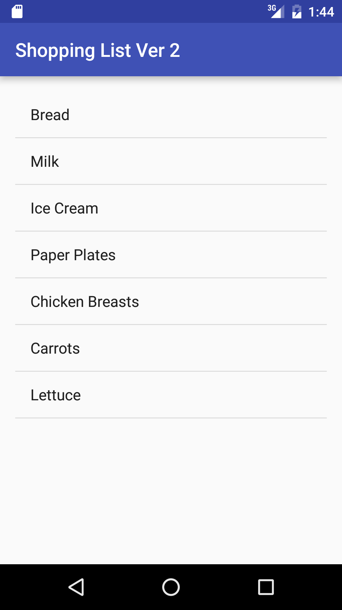

#  Cursor Adapters - Grocery List

## Introduction

In this lab, you will be displaying a list of grocery items from a SQLite database using a `CursorAdapter`. Each grocery item has a name, description, price, and type. On this screen, you will only be showing the name of each item.

## Exercise

#### Requirements

- Extend and complete the SQLiteOpenHelper class to query the database for all of the grocery items
- Make a ListView to display the grocery items
- Use a CursorAdapter to display the queried grocery items

**Bonus:**
- Create a custom layout for the ListView item to show more info from the database

#### Starter code

The `starter-code` folder contains an Android project with the following:

- A MainActivity.java file that prepopulates the database

#### Deliverable

The screenshot below shows what the app should look like.

  

## Additional Resources

- [Cursor](http://developer.android.com/reference/android/database/Cursor.html)
- [CursorAdapter](http://developer.android.com/reference/android/widget/CursorAdapter.html)
- [SimpleCursorAdapter](http://developer.android.com/reference/android/widget/SimpleCursorAdapter.html)
