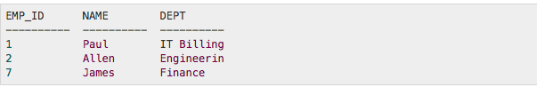

#  JOINS


### LEARNING OBJECTIVES
*After this lesson, you will be able to:*
* Connect tables with a foreign key: INNER JOIN statements

### STUDENT PRE-WORK
*Before this lesson, you should already be able to:*
- Create tables
- Use database in their apps
- Identify the reasons to use multiple tables

### INSTRUCTOR PREP
*Before this lesson, instructors will need to:*
- Read through the lesson
- Add additional instructor notes as needed
- Edit language or examples to fit your ideas and teaching style
- Open, read, run, and edit (optional) the starter and solution code to ensure it's working and that you agree with how the code was written

## Opening (5 mins)

Relationships specify the connection between tables and enable you to pull data together in meaningful ways. A hefty part of designing a relational database is dividing the data elements into related tables. Once you're ready to start working with the data, you rely on relationships between the tables - in practice, this is done with JOINS.


## Introduction: Review Primary/Foreign Key and SQLite Joins (20 mins)


The SQLite Joins clause is used to combine records from two or more tables in a database. A JOIN is a means for combining fields from two tables by using values common to each. When we talk about relationships between tables we use two basic concepts that you're already familiar with:

* foreign key
* primary key

Remember, **a primary key** is a column or group of columns that uniquely identify a row. Every table should have a primary key. And a table cannot have more than one primary key.


**A foreign key** is a column or set of columns in one table whose values must have matching values in the primary key of another (or the same) table. A foreign key is said to reference its primary key. Foreign keys are a mechanism for maintaining data integrity.

For example, we have two tables:  

Supplier ( **SupplierNumber**, Name, Address, Type )  
Invoices ( **InvoiceNumber**, *SupplierNumber*, Text )

The 'supplier number' is the primary key in the Supplier table. The foreign key in the Invoices table points to that primary key. The relational schema is the following. Primary keys are marked in bold, and foreign keys are marked in italics.

#### One More Example

Let's look at the table below. It is a relatively big table with a lot of columns and rows, which makes data reading and analyzing difficult. As you might have already noticed the columns Fruit, Fruit ID and Inventory has a lot of duplicate data.

<p align="text">
  
</p>

In order to make data more readable and well-organized we should exclude duplication and create two tables:  

<p align="text">
    
</p>

Thus, the table with fewer records, Available Fruits, has one record for each A, B, C, D, and E. The table with more records, Sales Today, has multiple records each for A, B, C, D, and E.


#### Types of JOINS

SQL defines three major types of joins:  

* CROSS JOIN - produces a result set which is the number of rows in the first table multiplied by the number of rows in the second table, if no WHERE clause is used along with CROSS JOIN. This kind of result is called as Cartesian Product. If, WHERE clause is used with CROSS JOIN, it functions like an INNER JOIN.  

<p align="center">
  
</p>

* INNER JOIN - selects all rows from both participating tables as long as there is a match between the columns.

<p align="center">
  
</p>

* OUTER JOIN - returns all rows from both the participating tables which satisfy the join condition along with rows which do not satisfy the join condition.  

<p align="center">
  
</p>

An INNER JOIN is the most common type of join and is the default type of join. You can use INNER keyword optionally. An INNER JOIN creates a new result table by combining column values of two tables (table1 and table2) based upon the join-predicate.

The query compares each row of table1 with each row of table2 to find all pairs of rows which satisfy the join-predicate. When the join-predicate is satisfied, column values for each matched pair of rows of A and B are combined into a result row.

Following is the syntax of INNER JOIN:  

```SQL
SELECT ... FROM table1 [INNER] JOIN table2 ON conditional_expression ...
```


## Demo: Inner Joins (15 mins)
Let's consider two tables COMPANY and DEPARTMENT:   

COMPANY:

<p align="center">
     
</p>

The table has 5 columns: ID, NAME, AGE, ADDRESS, SALARY.  

DEPARTMENT    

<p align="center">
     
</p>

The table has 3 columns: ID, DEPT, EMP_ID.

Based on the above tables, we can write an INNER JOIN as follows:  

```SQL
SELECT EMP_ID, NAME, DEPT FROM COMPANY INNER JOIN DEPARTMENT ON COMPANY.ID = DEPARTMENT.EMP_ID
```

The query will produce the following result:  

<p align="center">
    
</p>

As we can see from the query, we compare the tables based on one column in each table:
* ID in the table COMPANY  
* EMP_ID in the table DEPARTMENT  

The returned data includes information about EMP_ID, NAME and DEPT.

## Guided Practice: Inner Joins in Android (20 mins)

Import the project [starter-code](relationships-between-tables-lesson/starter-code). Discuss with the instructor the way both table are created (methods: `getInstance(Context context)`, `onCreate(SQLiteDatabase db)`, `insertRow(Employee employee)`,`insertRowDepartment(Department department)`) in the class Helper. Discuss why in Main Activity class the data gets put in the database in the AsyncTask and the text view gets updated on the UI thread.


In Android, using just SQL queries is not enough to get information from the database. As you might remember from your database lesson, you call `getWritableDatabase()` to get a SQLiteDatabase object, on which you call  `rawQuery() ` passing the query string. As a result you get a cursor object that returns entries:  

```java
String result = "default name";
SQLiteDatabase db = getWritableDatabase();
// Building query using INNER JOIN keyword.
String query = "SELECT NAME FROM COMPANY INNER JOIN DEPARTMENT ON COMPANY._ID = DEPARTMENT.EMP_ID";
Cursor cursor = db.rawQuery(query, null);
while(cursor.moveToNext()) {
  result = cursor.getString(cursor.getColumnIndex(DataEntryCompany.COLUMN_NAME));
}
cursor.close();
return result;
```  

Pay attention that after a cursor object is used, you should close it.   
Copy the above code and insert it in the method ```getNameJoins()``` in Helper java class.


  ```java
  public String getNameJoins() {
    // The string "default name will be returned if the right entries in the db cannot be found.
    String result = "default name";
    SQLiteDatabase db = getWritableDatabase();
    // Building query using INNER JOIN keyword
    String query = "SELECT NAME FROM COMPANY INNER JOIN DEPARTMENT ON COMPANY._ID = DEPARTMENT.EMP_ID";
    Cursor cursor = db.rawQuery(query, null);
    while(cursor.moveToNext()) {
      result = cursor.getString(cursor.getColumnIndex(DataEntryCompany.COLUMN_NAME));
    }
    cursor.close();
    return result;
  }
 ```

Run the app and you will see that the app will return the name "Harry".


Our query asks for the name of the person:  

```java
String query = "SELECT NAME FROM COMPANY INNER JOIN DEPARTMENT ON COMPANY._ID = DEPARTMENT.EMP_ID"
```

In the Main Activity class we added 3 employees and 3 departments:  

```java
Employee employee = new Employee("John", 32, "NY", 30);
Employee employee1 = new Employee("Harry", 31, "VA", 60);
Employee employee2 = new Employee("Mike", 30, "NY", 100);
```  

```java
Department department = new Department("IT Building", 7);
Department department1 = new Department("Engineering", 2);
Department department2 = new Department("Sales", 8);
```  
As mentioned above we compare two tables on the following columns:

* _ID in the COMPANY table
* EMP_ID in the DEPARTMENT table    

In our examples we can see that the second entry in the table COMPANY is associated with the name "Harry", the table has an "_ID" column that gets autoincremented every time we add a new entry. In the DEPARTMENT table the second row has EMP_ID equal 2. Thus, we get the name "Harry" returned in the method ```getNameJoins()```.

## Independent Practice: Inner Joins in Android (25 mins)

Using the app above, create another method ```getFullInformation()``` that will return not only the name of the person but will provide the information about the employee's age, address, salary and department. Change the query statement, the result string, which is supposed to return full information about the employee, in the Helper class and uncomment a line of code in Main Activity class to test the app.


```java
public String getFullInformation() {
    String result = "default information";
    SQLiteDatabase db = getWritableDatabase();
    // Building query using INNER JOIN keyword.
    String query = "SELECT NAME, ADDRESS, AGE, SALARY, DEPARTMENT FROM COMPANY INNER JOIN " +
        "DEPARTMENT ON" +
        " COMPANY._ID = DEPARTMENT.EMP_ID";
    Cursor cursor = db.rawQuery(query, null);
    while(cursor.moveToNext()) {
      result = cursor.getString(cursor.getColumnIndex(DataEntryCompany.COLUMN_NAME)) +
          ", who is " + cursor.getString(cursor.getColumnIndex(DataEntryCompany.COLUMN_AGE)) +
          " years old, lives in " + cursor.getString(cursor.getColumnIndex(DataEntryCompany
          .COLUMN_ADDRESS)) + ", earns "+ cursor.getString(cursor.getColumnIndex(DataEntryCompany
          .COLUMN_SALARY)) + " working in the " + cursor.getString(cursor.getColumnIndex
          (DataEntryDepartment.COLUMN_DEPARTMENT)) + " department.";
    }
    cursor.close();
    return result;
  }
```  


## Conclusion (5 mins)

- Why is it important to create different tables? Why should we not have one big table?
- What types of relationships have you learned about today?
- What is the most popular type of joins?
