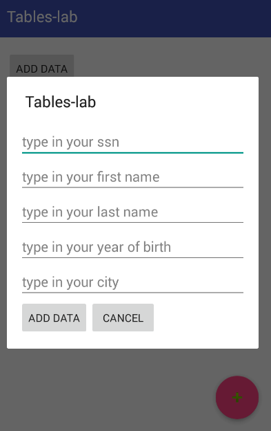
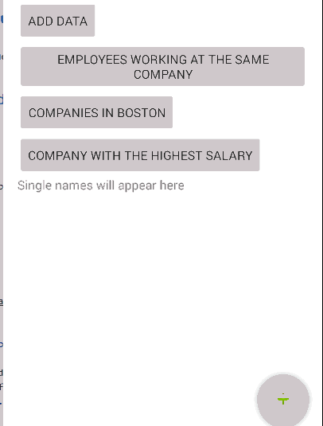

#  Relationships between Tables

## Introduction

In this lab, you will create a app with a database with two tables - Employee and Job.  

Employee table should have the following data:  

    

Job table should look like this:  

     

The main purpose of the app is to provide information, which is present in two tables:  

1.  show the full name of people working at the same company (Macys is used in the example)
2.  show the companies located in Boston  
3.  show the company with the highest salary  
4.  add new data to the table Employee

Your app doesn't need to look like the screenshot, but it needs to have the same functionality.

## Exercise

#### Requirements

The Main Activity should:  

- Contain a list view that will display the information from the tables if there are two or more entries returned
- Contain a text view that will display only the name of the company with the highest salary
- Contain 5 buttons:

    * **fab** - floating action button that will send an explicit intent to the other activity (DialogActivity)
    * **add data** - the button that will add the right information from the above screenshots to 2 tables in the database
    * **employees working at the same company** - the button that will return the full names of employees working at the same company and will display them in a ListView
    * **companies in Boston** - the button that will return companies located in Boston and will display them in a List View
    * **company with the highest salary** - the button that will return the company where the salary is the highest and will display its name in the Text View

- Contain 5 Edit Texts to enter these fields:
    * ssn
    * first name
    * last name
    * year of birth
    * city

- Contain 2 buttons:

    * add data - the button will save the information to the table Employee, will show a toast to the user confirming that the data has been added and will bring the user back to the Main Activity
    * cancel button - the button that will return the user to the Main Activity

**Bonus**: The Dialog Activity should:  
- Look like a dialog (use the theme "Theme.AppCompat.Light.Dialog.Alert")  

  

<!-- The app should be thread safe. To make app more responsive make sure to execute just one AsyncTask at a time. Thus, any async task that might be running, should be cancelled/stopped when another async task has just been started. -->

#### Deliverable

Here is the gif that will demo how the app works when the buttons are clicked.  

    

#### Resources:

- [ListView](https://developer.android.com/guide/topics/ui/layout/listview.html)
- [Textview](https://developer.android.com/reference/android/widget/TextView.html)
