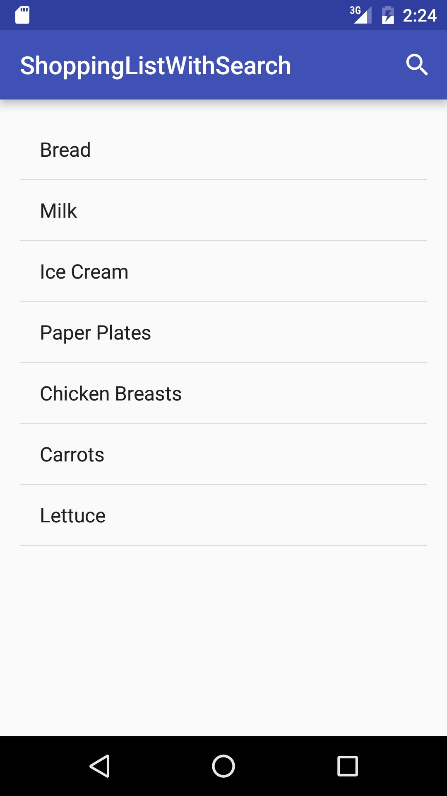
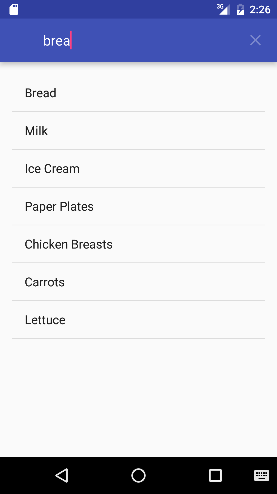
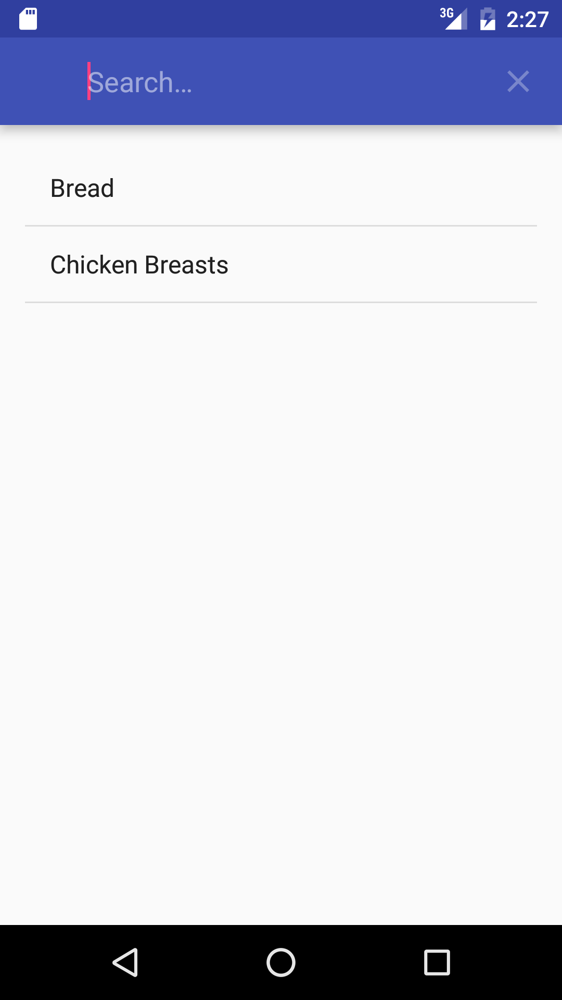

#  Enable Search - Grocery List

## Introduction

In this lab, you will be adding the ability to search through your grocery list to the toolbar, based on the name of the items. Your search must operate in one of two ways:

- Your search term can appear at the beginning of a word in the name
- Your search term can appear anywhere in the name (even in the middle of a word)

## Exercise

#### Requirements

- Allow the user to search through the grocery list
- Add a Searchable xml file
- Make required changes to the manifest to enable search
- Add a SearchView to your menu
- Implement search logic in your Activity
- Add search method to your database helper

**Bonus:**

- Display the type in the list item
- Add the ability to search by type

#### Starter code

The [starter-code](starter-code) folder contains an Android project with the following:

- An Android project with a pre-populated database
- Solution code to the previous Shopping List lab for cursor adapters

#### Deliverable

The screenshots below show what the app should look like.

  
  
  

## Additional Resources

- [SearchView](http://developer.android.com/reference/android/widget/SearchView.html)
- [Creating a Search Interface](http://developer.android.com/guide/topics/search/search-dialog.html)
