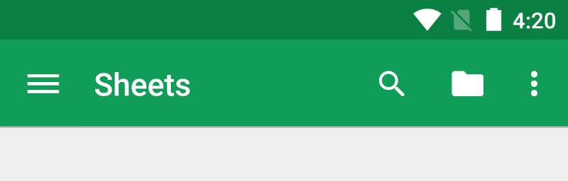
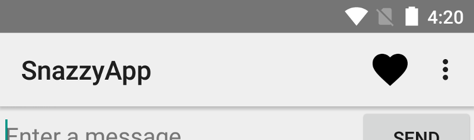

#  Toolbars and Menus


### LEARNING OBJECTIVES
*After this lesson, you will be able to:*
- Explain the difference between ActionBar and ToolBar
- Implement a menu in a ToolBar
- Place a ToolBar in places other than the ActionBar

### STUDENT PRE-WORK
*Before this lesson, you should already be able to:*
- Views 101/102/103

### INSTRUCTOR PREP
*Before this lesson, instructors will need to:*
- Gather materials needed for class
- Complete Prep work required
- Prepare any specific instructions

---
<a name="opening"></a>
## Opening (5 mins)

ToolBars are some of the most overlooked, yet most useful things we see in our apps. Our attention is often drawn to the main content on the screen, and the handy pixels tucked away at the edge of the screen are forgotten. Today, we will be exploring the ToolBar, its history, how to insert menus into it, and how to use the ToolBar in places other than the top.


***

<a name="introduction"></a>
## Introduction: ActionBar vs ToolBar (10 mins)



The ActionBar was introduced in HoneyComb (3.0) as a way to have a constantly available method of navigation around the app. Before this, apps used the menu button to bring up a pop-up that had extra options available.

When Ice Cream Sandwich (4.0) was released, the ActionBar was brought to phones as well.

Finally, when Lollipop (5.0) was released, an upgrade to the ActionBar came with it! The ActionBar was replaced with the ToolBar, a more flexible and straightforward way to implement the ActionBar. It was also added to the support library.

The ToolBar is its own UI widget that can not only do what the ActionBar did, but can also be moved to other parts of the screen, and hold any other Views in it as well.


***

<a name="demo"></a>
## Demo: Adding a Toolbar as an ActionBar. (10 mins)

Adding a Toolbar is just like adding any other View to our layout. Let's start with an empty activity and work our way up.

First, we need to make sure our styles.xml shows that we don't want to use an ActionBar.

```xml
<style name="AppTheme" parent="Theme.AppCompat.Light.NoActionBar">
```

With that done, we can add a ToolBar to our layout. Let's remove the padding from the layout first.

activity_main.xml
```xml
<android.support.v7.widget.Toolbar
    android:id="@+id/my_toolbar"
    android:layout_width="match_parent"
    android:layout_height="?attr/actionBarSize"
    android:background="?attr/colorPrimary"
    android:elevation="4dp"
    android:theme="@style/ThemeOverlay.AppCompat.ActionBar"
    app:popupTheme="@style/ThemeOverlay.AppCompat.Light"/>
```


Now we have a Toolbar, but we need it to be an ActionBar.

In our MainActivity.java, we need to get a reference to the Toolbar, and set it to be an ActionBar.

```java
Toolbar toolbar = (Toolbar)findViewById(R.id.my_toolbar);
setSupportActionBar(toolbar);
```


By making it an ActionBar, it adds additional functionality like the back button for easy navigation between activities.


***

<a name="introduction"></a>
## Introduction: Menus (10 mins)



Now that we've shown how to create a Toolbar, let's go through adding a Menu. While we could add Views as nested objects in the ToolBar, Menus give us a uniform, easy to implement system to present options to the user.

Menus are just like layouts in the sense that they have their own XMLs, and must be inflated.

Menus are made up of MenuItems, and if they can't all fit on the screen, they automatically move into the overflow menu (represented by the three dots in the top right).


***

<a name="guided-practice"></a>
## Guided Practice: Implementing a Menu (15 mins)

As we mentioned before, the Menu is similar to a layout, since it has XML and needs to be inflated.

Let's start by creating the XML in the menus XML folder. Each element in the menu is represented as an item.

```xml
<menu xmlns:android="http://schemas.android.com/apk/res/android"
    xmlns:app="http://schemas.android.com/apk/res-auto">
    <item
        android:id="@+id/action_share"
        android:icon="@android:drawable/ic_menu_share"
        android:title="@string/action_share"
        app:showAsAction="ifRoom"/>

    <item android:id="@+id/action_settings"
        android:title="@string/action_settings"
        app:showAsAction="never"/>

</menu>
```

Notice the showAsAction property. This allows us to tell Android if we want to have the item attempt to show up on the screen, or if it should go straight to the overflow menu.

Now, to get our menu to show up, we need to inflate it. To do this, we override a method in Activity called onCreateOptionsMenu

```java
@Override
    public boolean onCreateOptionsMenu(Menu menu) {
        MenuInflater inflater = getMenuInflater();
        inflater.inflate(R.menu.main_menu, menu);

        return super.onCreateOptionsMenu(menu);
    }
```
We simply get the inflater (MenuInflater), and tell it to inflate the menu.


Finally, to get our menu to respond to actions, we need to implement one last method, onOptionsItemSelected.

```java
@Override
public boolean onOptionsItemSelected(MenuItem item) {
    switch (item.getItemId()) {
        case R.id.action_settings:

            return true;

        case R.id.action_share:

            return true;

        default:
            // If we got here, the user's action was not recognized.
            // Invoke the superclass to handle it.
            return super.onOptionsItemSelected(item);

    }
}
```

That's it! We now have a fully functional Menu in our Toolbar.


***

<a name="ind-practice"></a>
## Independent Practice: Adding additional menu items (10 mins)

Now it's your turn to add more menu items. You will add four new menu items to the Toolbar, one of which needs to show in the overflow menu. Make each item perform a separate action (ie make a different toast pop up, change text on the screen, etc). Work in pairs.


***

<a name="introduction"></a>
## Introduction: Toolbars in other places (5 mins)

We aren't required to use Toolbars at the top of the screen. In fact, many apps also have them at the bottom.

Let's look at [Play Music](https://play.google.com/store/apps/details?id=com.google.android.music&hl=en).

Since the ToolBar is just another View object, we can simply add it to the layout.


***

<a name="guided-practice"></a>
## Guided Practice: Implementing a Menu (10 mins)

Let's start with a new app, and create it with a scrolling activity. We are going to add a Toolbar to the bottom, like how play Music has it. Right now, our entire Activity is contained in a CoordinatorLayout. Since we want to overlay the new toolbar, we are going to make a Framelayout to contain all of it.

```xml
<FrameLayout
    xmlns:android="http://schemas.android.com/apk/res/android"
    xmlns:app="http://schemas.android.com/apk/res-auto"
    xmlns:tools="http://schemas.android.com/tools"
    android:layout_width="match_parent"
    android:layout_height="match_parent">
```

Now we need to make a new Toolbar for the bottom of the screen. Put it below the CoordinatorLayout.

```xml
<android.support.v7.widget.Toolbar
        android:id="@+id/toolbar_bottom"
        android:layout_width="match_parent"
        android:layout_height="70dp"
        android:layout_gravity="bottom"
        android:background="#8e8e8e"/>
```

Now it's easy to add things to our Toolbar. For instance, let's put a TextView in there.

```xml
<TextView
    android:layout_width="wrap_content"
    android:layout_height="wrap_content"
    android:text="I am a toolbar!"/>
```


***

<a name="ind-practice"></a>
## Independent Practice: Finishing the bottom Toolbar (10 mins)

In pairs, finish the bottom Toolbar by making it look similar to Google Music. Make sure the play button responds to being clicked on by showing something like a Toast or Snackbar.


***

<a name="conclusion"></a>
## Conclusion (5 mins)

Toolbars and menus provide an easy way to add consistent, easy to find controls for our app, and are very important to your app design. Finding a balance between putting too few or too many items in your toolbars can be tricky, but is really makes your app shine when you get it right. Make sure your toolbars are part of your initial design rather than an afterthought.

***

### ADDITIONAL RESOURCES
- [Toolbars](http://developer.android.com/training/appbar/index.html)
