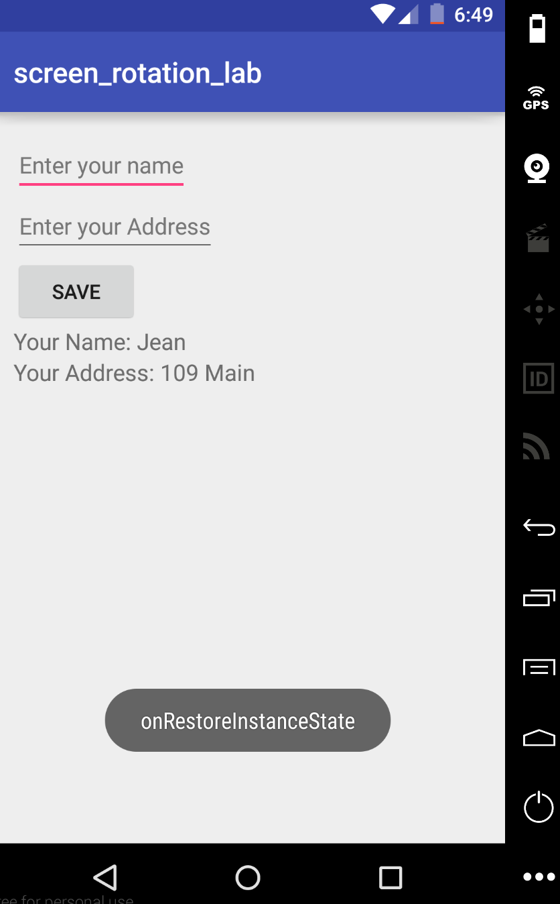
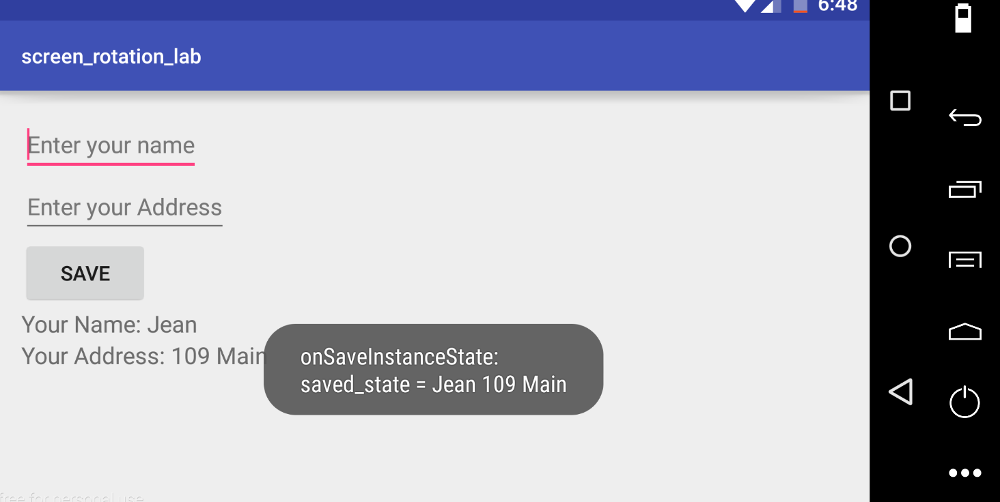

#  Activity Lifecycle and Screen Rotation Lab

# Proper Screen Rotation support for Android 

As many of you may have noticed when building Project 1 or in other labs/exercises, when we rotate the screen on Android, our Activity is restarted (onCreate() is called). This happens every time the screen is rotated - onDestroy() is called for the Activity, and then onCreate() is called. According to Android Developer documentation:

*"The restart behavior is designed to help your application adapt to new configurations by automatically reloading your application with alternative resources that match the new device configuration."* [Reference](https://developer.android.com/guide/topics/resources/runtime-changes.html)

To handle this properly, you should restore the Activity's state through onSaveInstanceState() before the Activity is destroyed. The state can then be restored in onCreate() or onRestoreInstanceState().

## Exercise 

Following [this guide](https://guides.codepath.com/android/Handling-Configuration-Changes) and [this guide](http://code.hootsuite.com/orientation-changes-on-android/), you'll be following the proper method to handle screen rotation changes with a simple Android app. The app scaffolding provided in the starter-code has two EditTexts and two TextViews, for inputting a name and address. Save the user input to display in the respective text fields with the onClickListener for the Save button. Next, use the onSaveInstanceState() and onRestoreInstanceState() methods to put and get the two String values in the savedInstanceState bundle, and retrieve them appropriately when the Activity is restarted. Also add in Toast methods to track the state in onSaveInstanceState() and onRestoreInstanceState(). Test your app through screen rotations to see that the correct data is persisting through rotation, and to see the Toast messages.

#### Requirements 

* Display EditText inputs of name and address in the two TextViews with the Save button. 
* Use onSaveInstanceState() and onRestoreInstanceState() to put and get these values, and correctly retrieve them when the Activity is recreated.
* Display Toasts for onSaveInstanceState() and onRestoreInstanceState()

#### Example Screenshots after user input:

(the Toast messages may succeed each other for each screen rotation)

  

  

