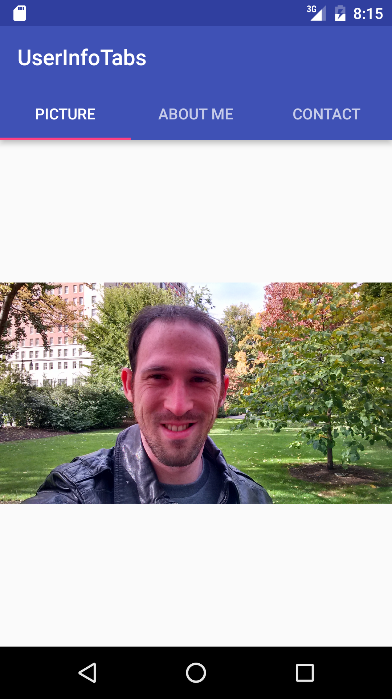
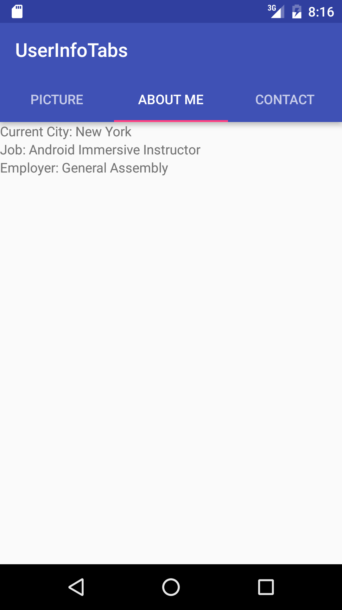
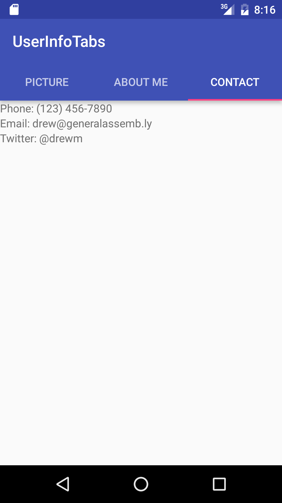

#  Fragments Lab

## Introduction

In this lab, you will be using fragments to create tabs in an application that show information about yourself! There will be 3 tabs, one with your picture, another with information about yourself (name, current city you live in, current job, etc.), and the third with contact information (phone, email, twitter, etc).

Starter code has been provided for working with tabs, but you need to complete the fragments.

## Exercise

#### Requirements

- Create one fragment that shows the user's picture
- Create a second fragment that shows the user's personal information
- Create a third fragment that shows the user's contact information
- Allow the user to switch between the three tabs

**Bonus:**
- Add extra tabs with more information

#### Starter code

[Starter code](starter-code) has been provided which sets up the tabs for you. You need to create your own fragments, and complete the switch statement in `PageAdapter.java` to add your fragments.

#### Deliverable

Create an app with the above requirements.

  

  

  

## Additional Resources

- [Fragments](http://developer.android.com/guide/components/fragments.html)
- [Tabs](http://developer.android.com/training/implementing-navigation/lateral.html)
