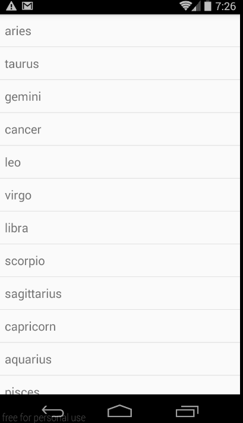
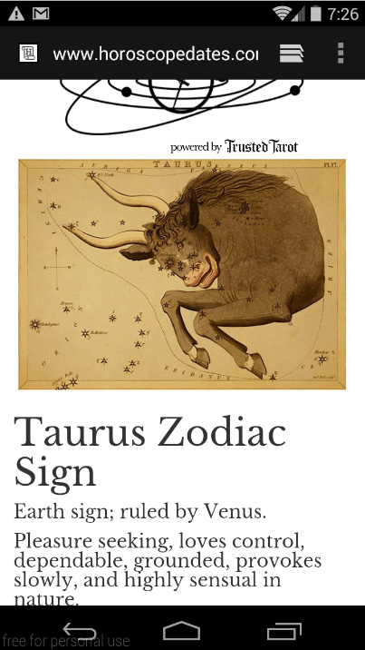
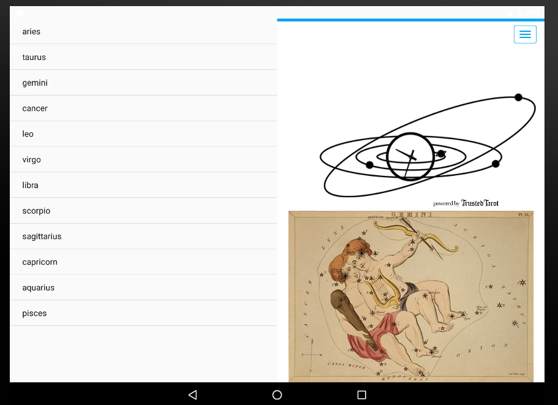

#  Usability Testing Lab

## Exercise  

You'll be running your own usability test and use the results of this test to give you guidance as you iterate on an application.

This lab is to be done in pairs. Using the starter code provided, pairs should run the app on a handset and on a tablet. One of the students will facilitate the test and write down the questions about UX/UI aspects of the app. The other student will be the "tester" and test the app.

The person who is interviewing should create a list of features he/she will ask the other person to test, step by step. When the list is ready and all the comments are put down, the team will work to improve the app using the comments and feedback from the interview.

#### Requirements

This lab is broken down into two parts: one part for preparing and testing the application and one part to act on the feedback from the test.  Take note of the suggested timing breakdowns and try note to look at part two until part one is complete.

##### Part One: Testing

*Before testing:*  
Steps for the person who will interview:
- create a list of all the necessary features to test (5 mins)
- create a list of all the steps to ask the other person to perform (5 mins)

Steps for the person who will test:
- while the other person is writing down the questions, create a list of potential use cases of the app (5 mins)
- create a list of additional features to be added (5 mins).

*While testing:*
- the person who tests the app should test every button, view and corner of the app, the other one should write down the comments
- the person who tests the app should suggest ways to improve the app, the other one should put the suggestions down

##### Part Two: Coding to improve the app

(You should have come up with these improvements during the test!)

- the app should support tablets and handsets
- when the item in the listVew is clicked, the app should open the weblink with information about the clicked sign

#### Starter code

Grab [starter code](starter-code/UsabilityTestingStarterCode) and import it into Android Studio.

Included in this lab are the following:

* Two activities: **Main Activity** and **Deatils Activity**.

	* Main Activity is an empty activity. It does not require any code added. Your task is to add a new layout for tablet devices.
	* Details Activity should send an implicit intent to bring up a webView and open a link with the information about the corresponding
	horoscope sign.

* Two fragments: **List Fragment** and **Details Fragment**.
These are the classes that require most of the work done. In the imported project you will find TODO: to finish.

* Three layout file: **activity_main.xml**, **fragment_layout**, **details_activity_layout.xml**.
You have to add **details_fragment_layout.xml** and **activity_main.xml(large)**.

#### Deliverable

An Android app that follows the requirements above. There are no design requirements; feel free to play around with color, font, backgrounds, etc.

Post the project on GitHub. Ensure that the project builds and runs successfully.

	  

If you're having a lot of trouble, feel free to peek at the [solution](solution-code).
