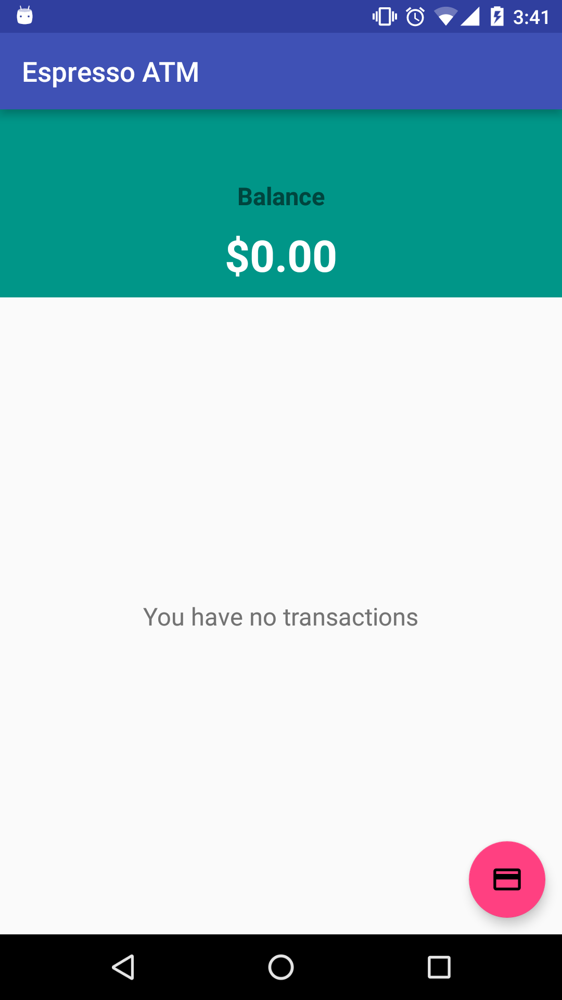
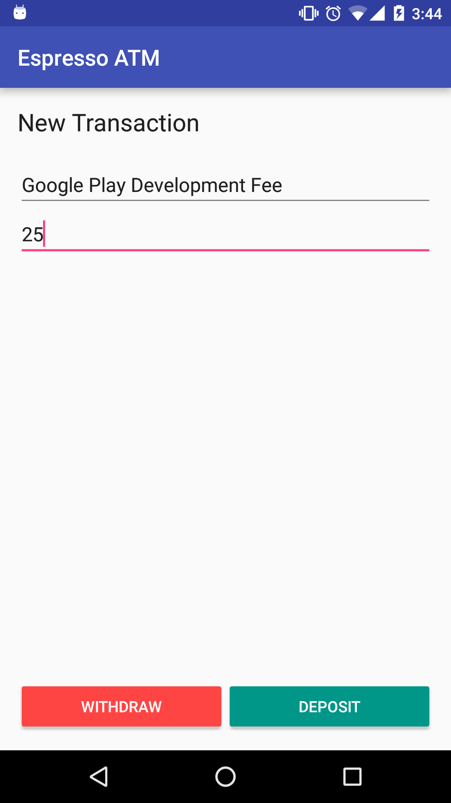
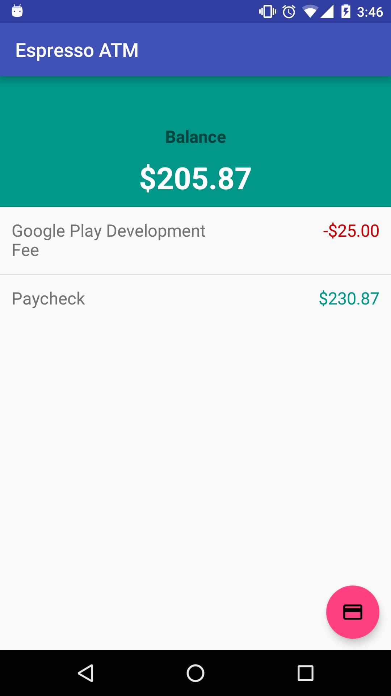

#  Espresso Lab

> ***Note:*** _This can be a pair programming activity or done independently._

## Exercise

For this lab, you will be testing a simple ATM app with Espresso. You will be given User Stories and are expected to test features based on them.

You will need to import the [starter code](starter-code) to get the app.

Take some time to play around with the app, see how it works. Also, familiarize yourself with the ids that the project uses.

    

#### Requirements

Use the following user stories for each test. "As a user":

* I can view my current balance.
* I can withdraw money from my account.
* I can deposit money into my account.
* I can perform multiple back-to-back withdrawals and deposits without fail.

**Bonus:**

* As a user, I can see a list of my previous transactions.
* As a user, I can see correct values for each listed transaction.
* Add any additional tests you feel would be good to have.

#### Deliverable

An app that meets the requirements above.

#### Resources

- [Android Developers - UI Testing](http://developer.android.com/training/testing/ui-testing/espresso-testing.html)
- [Intro to Espresso](https://androidresearch.wordpress.com/2015/04/04/an-introduction-to-espresso/)
