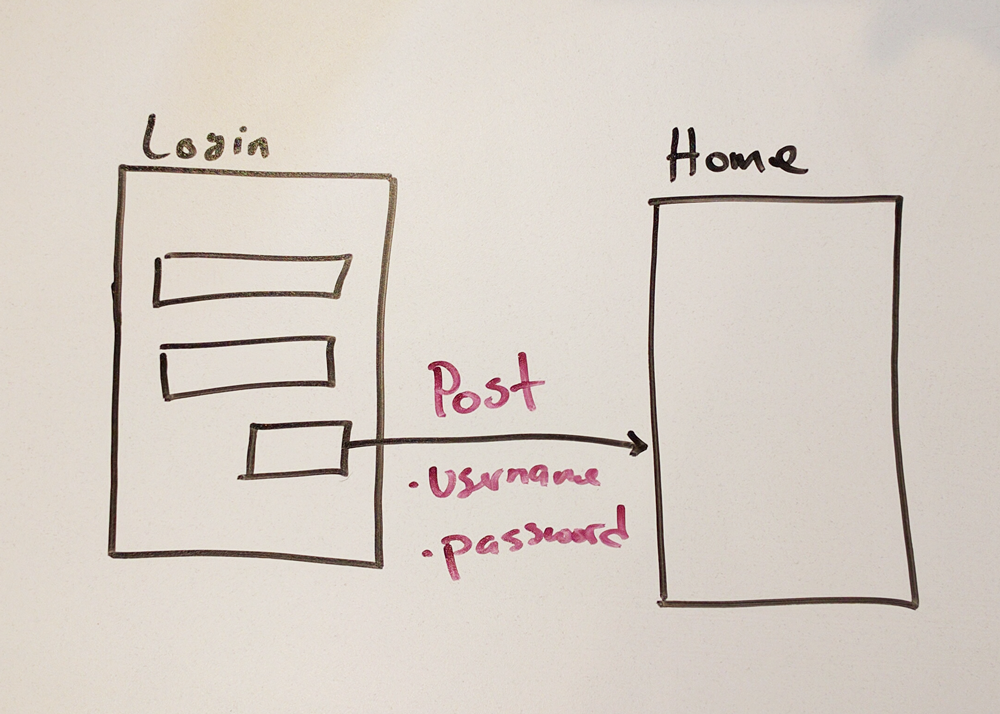

title | type | duration | creator
----- | ---- | -------- | -------
Practicing HTTP and REST Concepts | lab | 1:25 | James Davis (New York)

#  Practicing HTTP and REST Concepts

_This is a group exercise. Divide into groups of 3 or 4._

You just learned about HTTP methods and REST. For this lab, you will identify the specific method used in particular web requests and the data sent along with the request, if any exists.

First, you and your group must choose one of the following apps:

* A custom Social Network
* A custom Clothing Store
* YouTube
* GitHub
* Instagram
* Spotify

Then, on a white board: draw out the many screens of the app you choose; draw arrows that represent HTTP requests between each screen; and label each arrow with the HTTP method associated with the request and any data that is sent with it.

Here's an example: When clicking the login screen, a POST request is made, sending the username and password to the server.

  

Finally, you'll list out all the requests you've identified and take pictures of your drawings. Both of these will be submitted as your deliverables.

#### Requirements

* Draw a multi-screen prototype of one of the six apps recommended above
* Draw arrows between each screen and identify the HTTP method and data (if any) associated with the request
* Take a picture of your drawings and place the image in the [images](images) folder
* List of all the requests you've identified, including HTTP method and data sent, in the [answers](answers.md) markdown file

**Bonus:** Do all of the following again for an email app (like Gmail).

#### Deliverables

Submit a pull request with:

* A picture of your prototype request diagram, with labeled methods and data, in the [images](images) folder
* A list of requests made in the [answers](answers.md) file
  * Here's an example of what your answers.md file should look like for each request:
    1. Login => Home
      * Method: POST
      * Data: username; password
