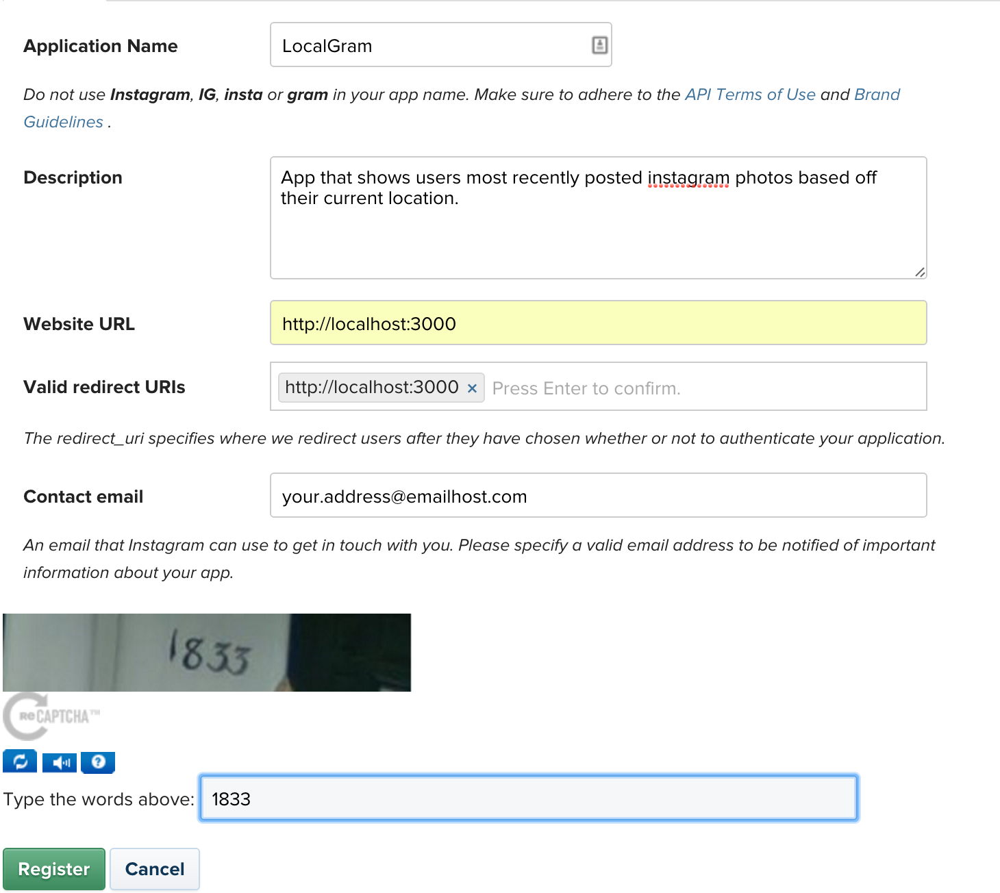

# Homework for Wednesday night

### 1) Create InstaGram account
You need to create an [Instagram account](https://www.instagram.com/) or you can use your existing account.
- We will be registering this account as a developer with instagram.
- Note: You may have to register new account using a mobile app if the web option does not exist for you.

### 2) Register as developer
You can register as a developer [here](https://www.instagram.com/developer/register/). It will ask you to login, you can use the account you created in step 1.

### 3) Register a new client
Once you've logged into your developer account after it was registered in step 2, you should see a big button asking you to
register a client. Click on it.

At the top right corner you will see a green button for `Register A New Client`. Press on it.

Then fill in the information like from the image below, don't use `LocalGram` as a name.. use something without `gram` or insta in the name.

For the **redirect uri** you should jsut copy and paste the website url into the field and make sure it has the little box with an `x` option just like in the image. Otherwise the site has issues..

Once you create the account you'll see a CLIENT_ID and CLIENT_SECRET. We will use these values tomorrow.

