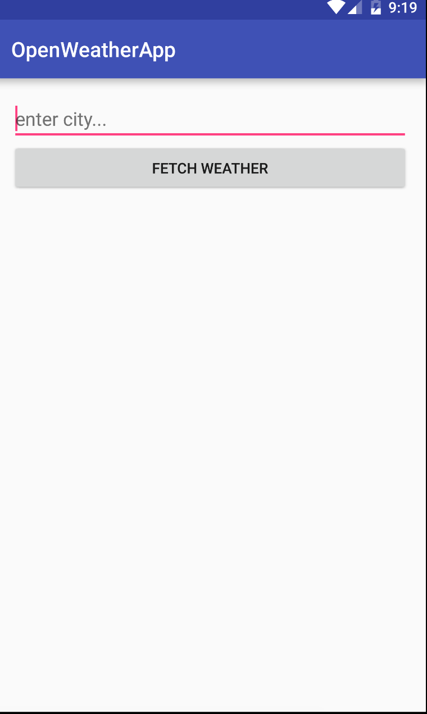
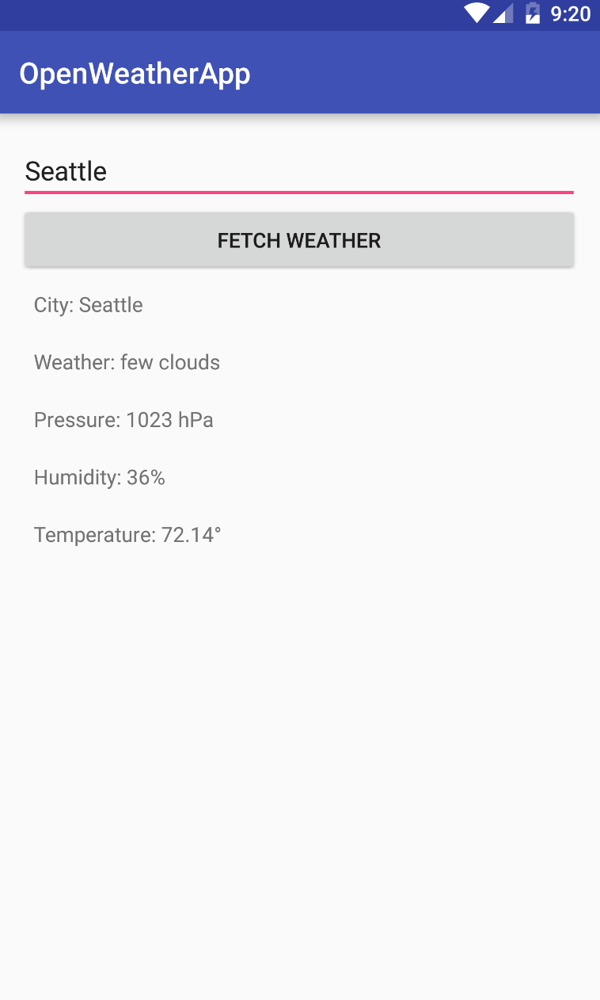

#  Making an HTTP call from Android

## Introduction

> ***Note:*** _This can be a pair programming activity or done independently._

In this lab, you will be building an app that sends a GET request to pull information from about the weather based on a city EditText entry from the user. You will be working with the search endpoint of the API and using it to find and display information about the weather, and you will use queries with Retrofit.

You'll need to generate your own API key for this lab (see below).  

Your app doesn't need to look like the deliverable below, but it needs to have the same functionality.

## Exercise

#### Requirements

- register (free) with  app and get an API key from the [OpenWeatherMap API](https://home.openweathermap.org). 
- Read some of the basic [API Documentation](http://openweathermap.org/current) for the current weather API. 
- Your App will have an EditText for a city input, and 4 TextViews that will display the city name, weather description, humidity, pressure, and temperature. 
- If you're unsure of how to use the user input for city query, read how to use @Query with Retrofit to use a text input here in the [documentation](http://square.github.io/retrofit/) for Retrofit.
- Make models for each of the necessary classes using http://www.jsonschema2pojo.org/
- Make an interface for the API and use it with Retrofit in your MainActivity to display the requirements

  * make sure to also check if the connection is available!

If you get stuck, you may peek at the sample solution.

#### Deliverable

Here is an image of an example working app:

  

  

## Resources

[OpenWeatherMap API](https://home.openweathermap.org)

[Retrofit](http://square.github.io/retrofit/)
