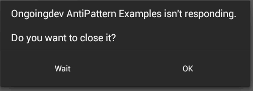

#  Threading

### LEARNING OBJECTIVES
*After this lesson, you will be able to:*
* Define threading
* Explain why multiple threads are important
* List main issues that prevent code from being thread-safe
* Create a basic async task

### STUDENT PRE-WORK
*Before this lesson, you should already be able to:*
- create different UI views
- set views on click listeners and handle touch events
- manipulate the visibility of views

### INSTRUCTOR PREP
*Before this lesson, instructors will need to:*
- Read through the lesson
- Add additional instructor notes as needed
- Edit language or examples to fit your ideas and teaching style
- Open, read, run, and edit (optional) the starter and solution code to ensure it's working and that you agree with how the code was written

## Opening: Threading (5 mins)

Today we will be learning about a topic called Threading, something that will make your apps run much smoother and more efficient. After this lesson you will be able to perform actions in separate threads and make your app more responsive. It is of top priority for any developer to make sure the app is not sluggish and is highly responsive.

## Introduction: Why threading? (15 mins)

Up until now, all of our code has been executed one command after another, in a linear fashion. What if we wanted to do multiple things at once? Sometimes it makes more sense to split up our work so the device can perform multiple operations simultaneously, and respond once that extra task is done.

A thread is a concurrent unit of execution. It has its own call stack for methods being invoked, arguments and local variables. Threads are the cornerstone of any multitasking operating system and can be thought of as mini-processes running within a main process, the purpose of which is to enable at least the appearance of parallel execution paths within applications.

Try to picture a thread: Lets say you have made a program to show some text on the screen. Now when you run the program all the code execution happens on one imaginary line (thread).

#### UI/main thread  

When an application is launched, the system creates a thread of execution for the application called **main.** This thread is very important because it is in charge of dispatching events to the appropriate user interface widgets, including drawing events. It is also
the thread in which your application interacts with components from the Android UI toolkit (components from the android.widget and android.view packages). As such, the main thread is also sometimes called the **UI thread.**

When your app performs intensive work in response to user interaction, this single thread model can yield poor performance unless you implement your application properly. Specifically, if everything is happening in the UI thread, performing long operations such as network access or database queries will block the whole UI. When the thread is blocked, no events can be dispatched, including drawing
events. From the user's perspective, the application appears to hang. Even worse, if the UI thread is blocked for more than a few seconds - about five seconds currently - the user is presented with the infamous **application not responding (ANR)** dialog. The user might then decide to quit your application and uninstall it if they are unhappy.  



##### Worker thread

Because of the single thread model described above, it's vital to the responsiveness of your application's UI that you do not block the UI thread. If you have operations to perform that are not instantaneous, you should make sure to do them in separate threads, known as **background** or **worker** threads.

Additionally, the Android UI toolkit is not thread-safe. So, you must not manipulate your UI from a worker thread: you must do all manipulation to your user interface from the UI thread. Thus, there are simply two rules to Android's single thread model:

1.  Do not block the UI thread; instead, create a worker thread for long-running tasks
2.  Do not access the Android UI toolkit from outside the UI thread


## Demo: Showing How The App Can Be Unresponsive (5 mins)

Import the [starter code](starter-code).

In this app, pressing a button adds 1000 new rows to the database. This can be a time-consuming operation and will cause the UI to freeze while it's happening. Let's try running it!

As you can see, the text indicating the database operation and the progress bar don't ever appear.


This is a very bad practice because the UI thread is blocked and users cannot interaction with the app.

## Introduction: Async Task (15 mins)

So what exactly does it mean to be asynchronous?


From StackOverflow:

"When you execute [a program] synchronously, you wait for [tasks] to finish before moving on to another task. When you execute [a program] asynchronously, you can move on to another task before [a previous task] finishes."

AsyncTask allows you to perform asynchronous work on your user interface. It performs the blocking operations in a worker thread and then publishes the results on the UI thread.

To use it, you must subclass `AsyncTask` and implement the `doInBackground()` callback method, which runs in a pool of background threads. To update your UI, you should implement `onPostExecute()`, which delivers the result from `doInBackground()` and runs in the UI thread, so you can safely update your UI. You can then run the task by calling `execute()` from the UI thread.  

The three types used by an asynchronous task are the following:

* Params - the type of the parameters sent to the task upon execution
* Progress - the type of the progress units published during the background computation
* Result - the type of the result of the background computation

Not all types are always used by an asynchronous task. To mark a type as unused, simply use the type Void:

```java
private class MyTask extends AsyncTask<Void, Void, Void> { ... }
```
When an asynchronous task is executed, the task goes through four steps with associated methods:

1.   `onPreExecute()`, invoked on the UI thread before the task is executed. This step is normally used to setup the task, for instance by showing a progress bar in the user interface.

2.   `doInBackground(Params...)`, invoked on the background thread immediately after `onPreExecute()` finishes executing. This step is used to perform background computation that can take a long time. The parameters of the asynchronous task are passed to this step. The result of the computation must be returned by this step and will be passed back to the last step. This step can also use `publishProgress(Progress...)` to publish one or more units of progress. These values are published on the UI thread, in the `onProgressUpdate(Progress...)` step.

3.  `onProgressUpdate(Progress...)`, invoked on the UI thread after a call to `publishProgress(Progress...)`. The timing of the execution is undefined. This method is used to display any form of progress in the user interface while the background computation is still executing. For instance, it can be used to animate a progress bar or show logs in a text field.

4.  `onPostExecute(Result)`, invoked on the UI thread after the background computation finishes. The result of the background computation is passed to this step as a parameter.

## Guided Practice: Improve responsiveness of the app (15 mins)

Let's create our AsyncTask! As we saw previously, we need to define our class first, then fill in the methods.


```java
private class DatabaseAsyncTask extends AsyncTask<Void,Void,Integer>{
        @Override
        protected void onPreExecute() {
            super.onPreExecute();
            //TODO: Change text to indicate items are being added
            //TODO: Make progress bar visible
        }

        @Override
        protected Integer doInBackground(Void... params) {
            //TODO: Add items to database
            //TODO: Return number of items in the database
        }

        @Override
        protected void onPostExecute(Integer count) {
            super.onPostExecute(count);
            //TODO: Hide progress bar
            //TODO: Update text to indicate all items are added, and display the current count
        }
    }
```


## Independent Practice: Add a progress bar (15 mins)

Work with a partner to complete all of the TODO items left in the code. Remember to think through why we are completing each step in its respective method.


## Conclusion: (10 mins)

Let's discuss the following questions:

1. How many threads are created when the app is launched?
2. What is the name of the thread that takes care of performing long-lasting operation in the background?
3. What is an AsyncTask?
4. What is the only method that must be overridden when using AsyncTask?
5. What should be done in `onPostExecute`?

When an application is started in Android the system will create a single thread for that application - UI/main thread. Performing longer tasks on this thread means blocking the user interface. For this reason, anything that is computationally more intensive or might take longer for other reasons should be carried out in a thread separate from the main thread. Only by making the app responsive, you can be sure that users will enjoy your app and keep interacting with it.
