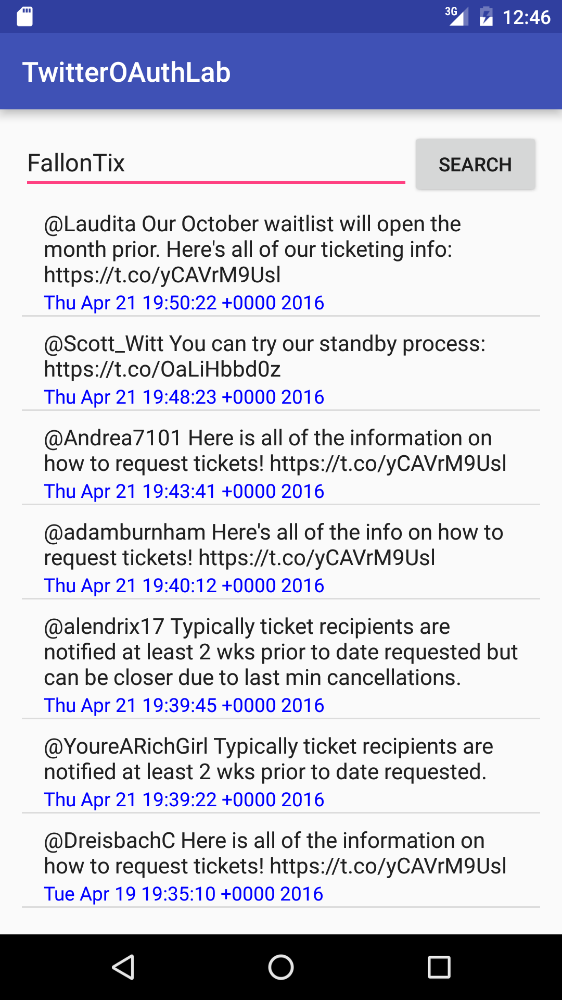

#  OAuth Twitter Lab

## Introduction

In this lab, you will be creating a Twitter Client to retrieve the 20 most recent tweets from a provided Twitter account and display the text and date on the screen. The user should have the ability to type in any Twitter handle and have the tweets display.

- [Register your app on twitter here](https://apps.twitter.com/)
- [If you are NOT doing the bonus, you can follow this authentication flow](https://dev.twitter.com/oauth/application-only)
- [If you are doing the bonus, you need to follow this authentication flow](https://dev.twitter.com/web/sign-in/implementing)

**Hint**: If you are having trouble navigating the API, try [this link](https://dev.twitter.com/rest/reference/get/statuses/user_timeline)

## Exercise

#### Requirements

Your app should:

- Display the 20 most recent tweets from a given user
- Display the tweet text and date
- Allow the user to type in any Twitter user name to display that user's tweets

**Bonus:**
- Allow the user to post tweets from within your app

#### Deliverable

An app that meets the requirement above. The screenshot below is just an example (the UI design is up to you).

  

