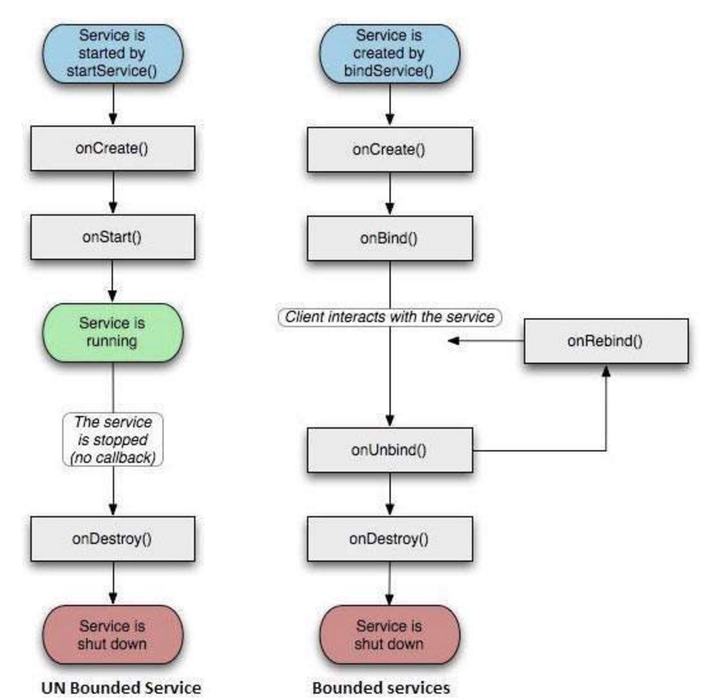

#  Bound Services

### Objectives
*After this lesson, students will be able to:*

* Describe what a bound service is
* Use a bound service in a basic Android app

### Preparation
*Before this lesson, students should review the following lessons:*


### STUDENT PRE-WORK
*Before this lesson, you should already:*
- Read over/review Services lesson and lab

### INSTRUCTOR PREP
*Before this lesson, instructors will need to:*
- Open and test the provided starter and solution code


## Opening (20 mins)

#### What is a bound service?

A bound service is the server in a client-server interface, and it allows components (such as activities) to bind to the service, send requests, receive responses, and even perform interprocess communication (IPC). 

A bound service typically lives only while it serves another application component and does not run in the background indefinitely.

*This type of service can be used when we want to communicate with service from an application component(like an Activity). For example we can upload data in background using service and we can call its public function to check uploading status and display it on the UI.*

This is in contrast to an *Unbound* Service, which calls at the life span of the calling activity, and would continue to run in the background, even if the original component that initiated it is destroyed. For instance, when started, a service would continue to play music in the background indefinitely.

## Bound Service flow (20 min)


<p align="center">
  
</p>

If the activity wants to interact with the service directly, it can use the bindService() method to start the service.

This method requires a ServiceConnection object as a parameter which is called on the service start and when finishing its onBind() method. This method returns a IBinder object to the ServiceConnection.

This IBinder object can be used by the activity to communicate with the service.

When the binding process has finished, the onStartCommand() method in the service is called with the Intent object used for the bindService() method.

If the service runs in the same process as the activity, it is possible to return the service to the activity. This allows that the activity can call methods of the service directly.

## Guided Practice: Steps to Implementing a bound service (30 min)

The steps to bind a service to a client are as follows:

1. Implement a Service Connection with methods onServiceConnected() and onServiceDisconnected().

	i. onServiceConnected() delivers the IBinder returned by the service's onBind() method.

	ii. onServiceDisconnected() is called when the connection to the service is unexpectedly lost, such as when the service has crashed or has been killed. This is *not* called when the client unbinds.

2. Call bindService(), passing the ServiceConnection implementation.

3. When the system calls your onServiceConnected() callback method, you can begin making calls to the service, using the methods defined by the interface.

4. To disconnect from the service, call unbindService().

*Note:* If your client is still bound to a service when your app destroys the client, destruction causes the client to unbind, so it's is best to unbind with unbindService() when it is done with service operations.

## Code samples (10 min)

Here's what 1) looks like in code:

```java
LocalService mService;
private ServiceConnection mConnection = new ServiceConnection() {
    // Called when the connection with the service is established
    public void onServiceConnected(ComponentName className, IBinder service) {
    	//get a binder and cast it
        LocalBinder binder = (LocalBinder) service;
        mService = binder.getService();
        mBound = true;
    }

    // Called when the connection with the service disconnects unexpectedly
    public void onServiceDisconnected(ComponentName className) {
        Log.e(TAG, "onServiceDisconnected");
        mBound = false;
    }
};
```

And (probably in the onCreate for your MainActivity), you do step 2:

```java
Intent intent = new Intent(this, LocalService.class);
bindService(intent, mConnection, Context.BIND_AUTO_CREATE);
```

Steps 3 and 4 can be done where you interact with the service, and when you wish to unbind the service, respectively. Unbinding may occur for example when you call onDestroy(), and/or onStop().


## Conclusion (5 mins)

- What's a bound service?
- What are some use cases for bound services?

## Resources

-[Android Developers Docs](https://developer.android.com/guide/components/bound-services.html)
