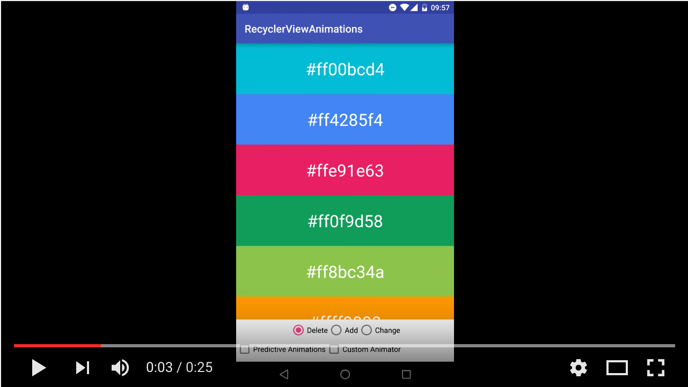

#  RecyclerView


### LEARNING OBJECTIVES
*After this lesson, you will be able to:*
- Understand why `RecyclerView` improves performance over `ListView`
- Add `RecyclerView` to xml
- Connect xml `RecyclerView` to Java code
- Use existing `CustomAdapter` and bind your own data set to display a list using `RecyclerView`
- Update `RecyclerView`'s `LayoutManager` from list to grid

### STUDENT PRE-WORK
*Before this lesson, you should already be able to:*
- Declare and use `ArrayLists` and `LinkedLists`
- Describe the basics of Android Views
- Understand basics of `XML`
- Understand how to bind views from `XML` to Java using `findViewById()`

### INSTRUCTOR PREP
*Before this lesson, instructors will need to:*
- Ready through the lesson and make necessary modification to match your teaching style
- Open and run the starter and solution code
- Add extra checks for understanding as needed

---
<a name="opening"></a>
## Opening (5 mins)

`RecyclerView` makes it easy to add **default** and **custom** animations for:
- Adding
- Removing
- Changing 

items in your data list. `ListView` makes these animations more difficult since they have to be **custom** and no defaults are provided for you.

[](https://www.youtube.com/watch?v=HMd_aaFBM20&feature=youtu.be "RecyclerView Animations")


***

<a name="introduction"></a>
## Introduction: Topic (10 mins)

`RecyclerView` is **preferred** over `ListView` in industry.

You can read a comparison between `RecyclerView` and `ListView` [here](http://www.truiton.com/2015/03/android-recyclerview-vs-listview-comparison/)

###### Pro's of using `RecyclerView`:
- Requires the use of the [View Holder Pattern](https://developer.android.com/training/improving-layouts/smooth-scrolling.html#ViewHolder) pattern, which recycles views and does not make uneccessary calls to `findViewById()` which is [expensive](http://stackoverflow.com/questions/26037744/efficiency-of-findviewbyid). `ListView` suggests using the pattern but does not require it.
- You can easily change your data to be displayed either as a list, a grid, or staggered grid using `LayoutManager`. If you wanted to change your `ListView` into a grid, you would have to use a `GridView` instead. Forcing you to re-write code.
- Google provides a [DefaultItemAnimator](https://developer.android.com/reference/android/support/v7/widget/DefaultItemAnimator.html) class making add/remove/update animations free out of the box. This also makes custom animations easier. `ListView` has no easy way of animating each list item.
- [ItemDecoration](https://developer.android.com/reference/android/support/v7/widget/RecyclerView.ItemDecoration.html) class allows developers to easily add decorations such as **dividers** to each list item. Dividers in `ListView` require us to create a divider view inside the `list_item.xml` layout.

###### Con's of using `RecyclerView`:
- More complex to implement then `ListView`
- Required to create a custom adapter. Meanwhile, `ListView` has `ArrayAdapter`, `CursorAdapter`, `SimpleCursorAdapter` for free use out of the box.
- No default [OnItemClickListener](http://developer.android.com/reference/android/widget/AdapterView.OnItemClickListener.html) making detecting item clicks more difficult. However, `RecyclerView` does use [OnItemTouchListener](https://developer.android.com/reference/android/support/v7/widget/RecyclerView.OnItemTouchListener.html) which allows for more customization, especially with gestures.


###### Overall, the benefits of `RecyclerView` outweight the cons. 
- You have a lot more freedom for customization. 
- You get a performance boost by using the `ViewHolder` pattern. 
- Google [recommends](https://developer.android.com/training/material/lists-cards.html) to use `RecyclerView` widget when you have data collections whose elements change at runtime based on user action or network events.

<a name="demo"></a>
## Demo: Creating RecyclerView in 4 steps! (20 mins)

#### Step 1) ( 2mins )

In your app gradle file, add the following line if its not already there:
```java
'com.android.support:recyclerview-v7:23.1.1'
```

> Instructor note: Make sure to check the library version and update as necessary 

**Note:** Make sure to sync gradle after adding that line. Let gradle finish its work before you move on.

#### Step 2) ( 3mins )

Add recycler view to your xml layout like so:
```xml
    <android.support.v7.widget.RecyclerView
        android:id="@+id/recycler_view"
        android:scrollbars="vertical"
        android:layout_width="match_parent"
        android:layout_height="match_parent"/>
```

> Check: Pair up and discuss in which xml file we would add this. Give students 30 sec.

#### Step 3) ( 5 mins )

Inside your Activity, at the very top declare the following member variables:
```java
	private RecyclerView recyclerView; 
    private RecyclerView.Adapter rvAdapter; 
    private RecyclerView.LayoutManager rvLayoutManager; 
    
    private LinkedList<String> dataList = new LinkedList<String>(); 
```

- **recyclerView**: The `RecyclerView` itself
- **rvAdapter**: The **R**ecycler**V**iew (**rv**) adapter holding the data and binding it to the item layout
- **rvLayoutManager**: The **R**ecycler**V**iew (**rv**) layout manager in charge of the layout type. (i.e. LinearLayout, StaggeredGridLayout, GridLayout )
- **dataList**: Your list of data

> Check: Ask students why we chose to use a `LinkedList` vs an `ArrayList`

> Solution: `LinkedList` has `O(1)` complexity for adding/removing elements. RecyclerView is meant to be used for dynamic data sets that change often, either by adding and removing items or by updating them ( `ArrayList` is more efficient for updating items since it has `O(1)` lookup complexity while `LinkedList` is `O(n)`.

#### Step 4) ( 10 mins )

Move to your Activity's `onCreate()` method and take the next **4 steps** ( a, b, c, d)

###### Step a) 

Assign a value to your `recyclerView` variable:
```java
recyclerView = (RecyclerView) findViewById(R.id.recycler_view);
```

###### Step b) 

Add data to your `dataList`:
```java
	dataList.add("Arizona");
	dataList.add("California");
	dataList.add("New Mexico");
	dataList.add("New York");
```

###### Step c)

Set your Layout Manager `rvLayoutManager`.
```java
	rvLayoutManager = new LinearLayoutManager(this);
	recyclerView.setLayoutManager(rvLayoutManager);
```

Layout Managers you can choose from:
- `LinearLayoutManager`: Similar to list view
- `GridLayoutManager`: Lays out items in a grid
- `StaggeredGridLayoutManager`:  Lays out all items in a staggered grid formation. Supports both horizontal and vertical layouts.


###### Step d) 

Create an instance of your custom adapter `rvAdapter`:
```java
    rvAdapter = new CustomRecyclerViewAdapter(dataList);
    recyclerView.setAdapter(rvAdapter);
```

#### Completion

That's it! If you followed along and added steps a, b, c, and d into your `onCreate()` then you now you have a working `RecyclerView`.

Note: For this lesson we use a **pre-made** `CustomRecyclerViewAdapter` class. The next lesson will cover how to
create your own custom recycler view adapters.

***

<a name="ind-practice"></a>
## Independent Practice: Topic (20 minutes)

Open the [starter code](starter-code/) and complete the following steps  
* Step 1
* Step 2
* Step 3
* Step 4

There are TODO's in  each of files
* gradle
* activity xml
* MainActivity


**Bonus**: 
* Turn ReyclerView into Grid or Staggered grid by using one of the other manages instead of LinearLayoutManager.

You can use [solution code](solution-code/) to check your work.

***

<a name="conclusion"></a>
## Conclusion (5 mins)

Using recycler view with a pre-made custom adapter is really easy. However, in most cases you will have to create your own
adapters - this part is covered in the next recycler view lesson. 

What are some advantages of using RecyclerView?
What are some disadvantages of using RecyclerView?

Recycler view is used widely in industry because of its flexibility and performance. Make sure you are comfortable and understand the ins and outs of Recycler view.

### ADDITIONAL RESOURCES
- [Google guide to creating RecyclerView](https://developer.android.com/training/material/lists-cards.html)
- [RecyclerView Class Documentation](https://developer.android.com/reference/android/support/v7/widget/RecyclerView.html)
- [ViewHolder Pattern](https://developer.android.com/training/improving-layouts/smooth-scrolling.html#ViewHolder)
- [Comparing RecyclerView and ListView](http://www.truiton.com/2015/03/android-recyclerview-vs-listview-comparison/)
- [findViewById() is expensive](http://stackoverflow.com/questions/14192709/is-it-possible-to-embed-youtube-vimeo-videos-in-markdown-using-a-c-sharp-markdow)
- [Guide to RecyclerView Animations](http://frogermcs.github.io/recyclerview-animations-androiddevsummit-write-up/)
- [Extensive guide to creating RecyclerView](https://guides.codepath.com/android/using-the-recyclerview#layouts)
