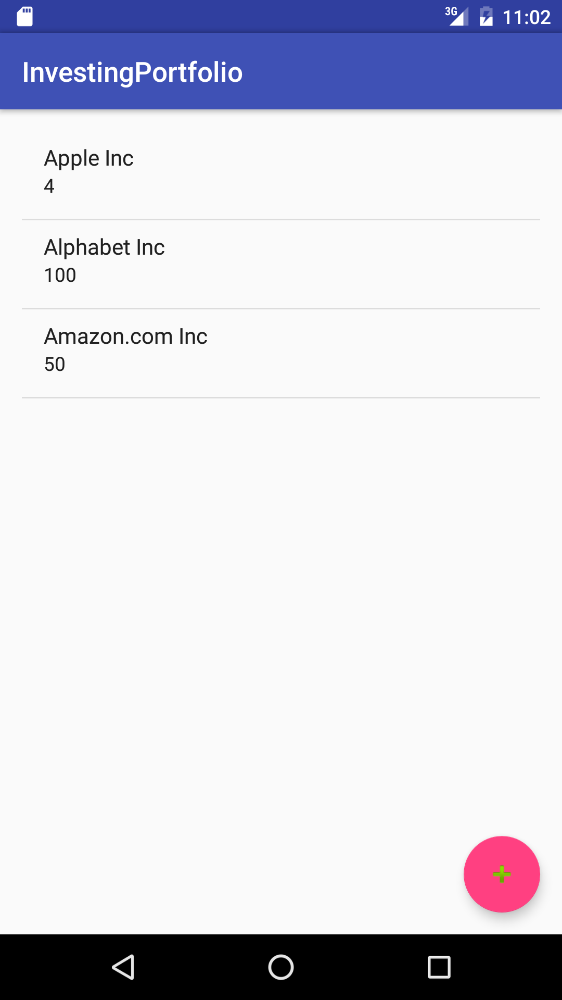
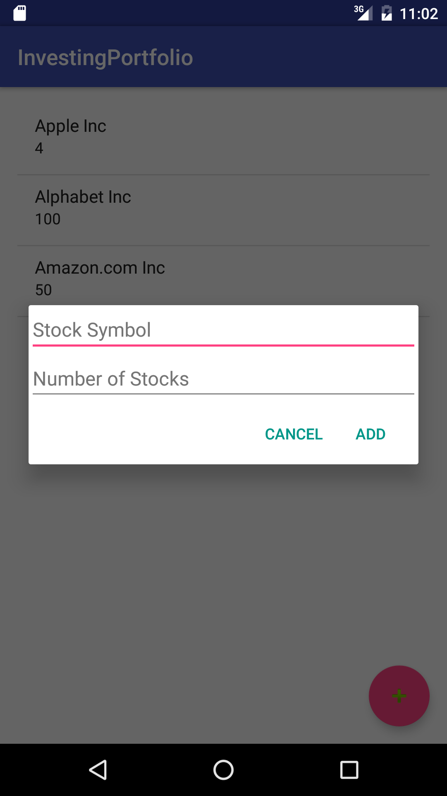

#  Content Providers

In this lab, you will be creating an app that will use the [MarkIt On Demand API](http://dev.markitondemand.com/MODApis/) to create a Stock portfolio. All data must be stored in a local database through a Content Provider. The user must be able to add a stock as well as the quantity they bought to the database in a dialog window (see screenshots below). On the screen, you must show the company name and quantity of stock purchased in a list. In addition, you must store what exchange the stock is traded on (ie NASDAQ) in the database.

The MarkIt API will be used to retrieve the company name and quantity of stock for each company.

## Exercise

#### Requirements

- Use a Content Provider to store data in a local database
- Store the stock symbol, company name, quantity of stock, and the stock exchange name in the database
- Use the MarkIt On Demand API
- Display the Company name and quantity of stock for each company
- Allow the user to enter a new stock using a dialog window

**Bonus:**

- Display the remaining information in the database for each stock entry

#### Starter code

No starter code for this lab!

#### Deliverable

An Android app that follows the requirements above:

  

  

## Additional Resources  
- [Android Developer Docs on Calendar Provider](http://developer.android.com/guide/topics/providers/calendar-provider.html)
