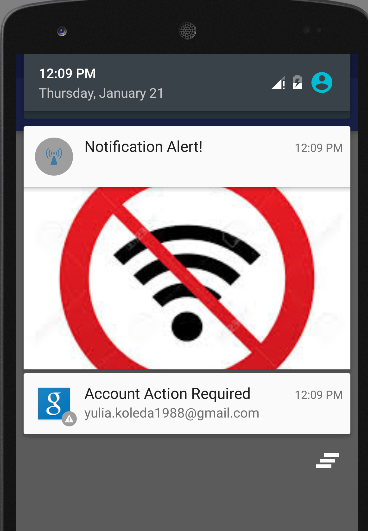

#  Notifications

## Introduction

In this lab, you will work with a partner to build a network notification app. The idea behind the app is to give the user information about connectivity state when the app gets opened.

When the app is launched, there should be an expanded notification with a large image informing the user about network connectivity. When the notification is clicked, the user should be redirected to another activity. If network is available,
the notification should be dismissed in the second activity. If network is not available, the notification icon should be kept at the top left corner of the app.

Your app doesn't need to look like the screenshot in the deliverable section below, but it needs to have the same functionality.

## Exercise

#### Requirements

The app should have 2 activities:  

- **Main Activity** that handles notification objects;  
- **Second Activity** that is responsible for dismissing the notification if it shows that the network connection is available

Your app should check network connection:

* When available:

  * show a notification with the an image (feel free to choose any image that will be associated with network connectivity)
  * redirect the user to a new activity when the notification is clicked
  * dismiss the notification in the new activity

* When unavailable:

  * show a notification with an image (feel free to choose any image that will be associated with network connectivity absence)
  * redirect the user to a new activity when the notification is clicked
  * make sure the icon does not go away unless the user swipes the notification away

**Bonus**

- Create another notification that has a "call" button; when the user presses the button, the phone dials any number

#### Deliverable

Here are two screenshots of the requirements:

  

  

If you get stuck, check out [the solution code](solution-code) for help.
