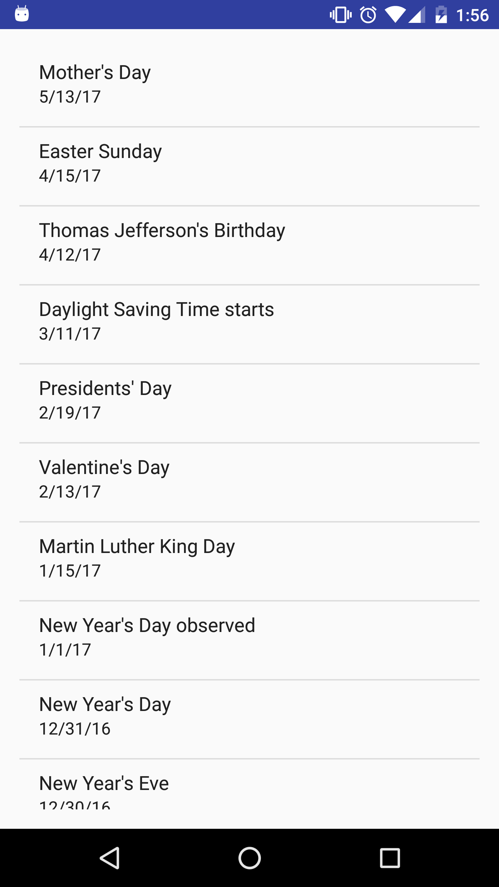
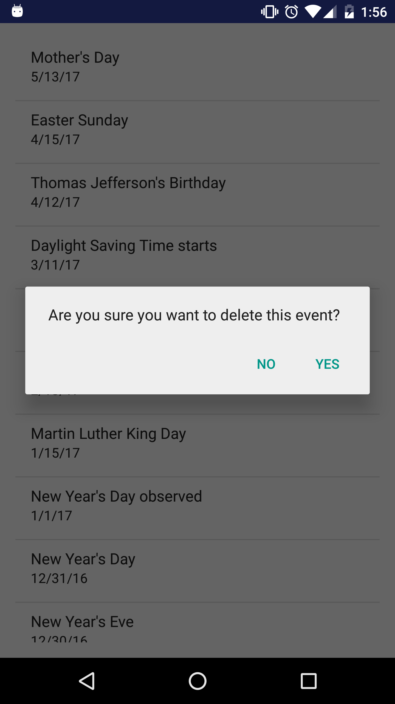

#  Content Providers

In this lab, you will be creating an app that will show the events in your phone calendar and will be interacting with the [calendar content provider](http://developer.android.com/guide/topics/providers/calendar-provider.html). The Calendar Content Provider follows much of the same design patterns as the other Content Providers we have worked with today.

In addition to showing all of the events, you must also allow the user to delete an event. Everything you need to accomplish this is included in the API documentation.

## Exercise

#### Requirements

- Display **title and date** for all calendar events in a ListView
- Display events in descending order by date (**reverse chronological order**)
- Allow the user to delete calendar events

**Bonus**

- Allow the user to create new events
- Allow the user to update an event

#### Deliverable

An Android app that follows the requirements above. There are no design requirements. If you would like to work on the UI, please feel free to modify it but prioritize the app's functionality, first.

When testing the app, make sure your phone is connected to your email account and has at least a few calendar events. Otherwise, your ListView may be empty.  

  

  

## Additional Resources  
- [Android Developer Docs on Calendar Provider](http://developer.android.com/guide/topics/providers/calendar-provider.html)
